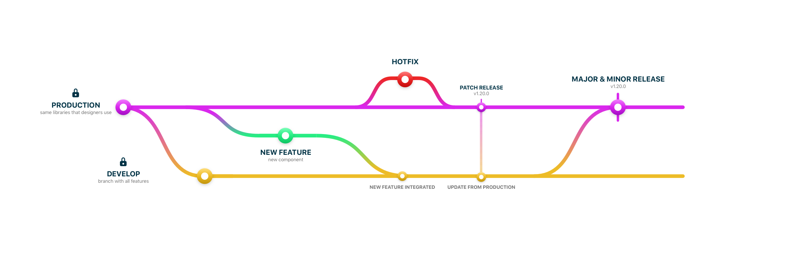

&nbsp;

&nbsp;

| Other Mística Repos                                              | Description                                               |
| :--------------------------------------------------------------- | :-------------------------------------------------------- |
| [mistica-web](https://github.com/Telefonica/mistica-web)         | Repository with code libraries for Mística in web         |
| [mistica-ios](https://github.com/Telefonica/mistica-ios)         | Repository with code libraries for Mística in iOS         |
| [mistica-android](https://github.com/Telefonica/mistica-android) | Repository with code libraries for Mística in Android     |
| [mistica-icons](https://github.com/Telefonica/mistica-icons)     | The source of truth for icons in our digital products     |
| [mistica-manager](https://github.com/Telefonica/mistica-manager) | App to allows designer install al the system in one-click |

---

- [Mística Discussions](https://github.com/Telefonica/mistica-design/discussions): The place to discuss all the topics to work in Mística
- [Mística Roadmap](https://github.com/Telefonica/mistica-design/projects/2): An overview of Mística planning
- [Mística Issues](https://github.com/Telefonica/mistica-design/issues): All the tasks with details

---

-  [Contribute to Mística](https://brandfactory.telefonica.com/document/1846#/contribute/how-to-contribute)
-  [Current components status](https://brandfactory.telefonica.com/document/1846#/components/overview)

---

 

# Figma

## How to sync design tokens

If you want to sync design tokens with Figma files you can use [Figma Tokens plugin](https://www.figma.com/community/plugin/843461159747178978/Figma-Tokens) and setup the plugin with the following information.

1. Open Figma Tokens Plugin, go to `Settings` and select `Github` in Token Storage
2. Add new credentials
- **Name:** The name of the brand
- **Personal Access Token:** you have to generate a token from Github and the paste in. [Read how to do it](https://docs.github.com/en/authentication/keeping-your-account-and-data-secure/creating-a-personal-access-token)
- **Repository:** `Telefonica/mistica-design`
- **Default Branch:** `production`
- **File Path:** `tokens/brandName.json` (see files [here](./tokens/))

3. Finally, go to `Tokens`, select `Global` and `Apply to document` and clic in `Update`

# Sketch
## How to install sketch development libraries

If you want to try development libraries and pull changes to production library, follow [this documentation](https://github.com/Telefonica/mistica-design/wiki/Install-development-libraries-with-Kactus) (please, read [contribution guidelines](https://brandfactory.telefonica.com/document/1846#/contribute/components-request) first)

## Release Workflow in Kactus 

Master branch always be a production version of Mística Design System Libraries. Ensure before of select a branch of the version that you want to work, you always have to work in a branch created from `Production` branch.

Every Friday, if there are substantial changes, we release a new version of library. So, **don't let anything without commited and pushed!**

#### Creating new branches

If you want to do a new branch, please, write the branch name with the correct name.

`name-short-description`  
`iceballos-fix-buttons-size`

#### POC Branches (Shouldn't be common)

If you want to test something to later will be integrated in libraries, you will be going to do that creating a _custom branch_ from production.

A custom branch always have to follow a structure in the name:  
`poc-name-short-description`  
`poc-iceballos-autolayout-list`

If this custom branch work fine, we can merge it with _develop_ branch through a pull request.

**When you make a new branch, don't publish immediately, work on this branch and publish it when you consider that your work is substantial. This avoids having a dirty repository.**
