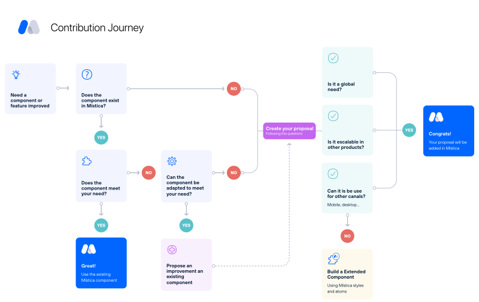

# Contribution guide

Welcome to the Mística Design System contribution guide for external teams.

As an external team, you have the opportunity to contribute to the Mística Design System by sharing your ideas and expertise.
Whether you are a designer, developer, or product manager, your contributions can help us improve the system and make it more useful for a wider range of users.

This guide is designed to help you understand how you can contribute to Mística, what kind of contributions we are looking for, and how to make sure your contributions are consistent with our way of working.

We encourage you to read this guide carefully and get in touch with us if you have any questions or feedback.

## Index

- [Proposal](#proposals)
- [Creation of an issue based on the proposal](#issues)
- [Updating or creating the specs needed](#specifications)
- [Development and final review](#from-design-to-development)

## Contribution journey

## Proposals

Before submitting a proposal, we encourage you to review:

* Our existing components and guidelines to ensure that your proposal aligns with our design principles and 
* There's no other discussion already covering the same topic. You can find all of our design guidelines and documentation on [Telefónica's brand factory](https://brandfactory.telefonica.com/d/iSp7b1DkYygv/n-a#/get-started/what-is-mistica).
* It's not covered by the existing [Component specs](https://www.figma.com/files/1125734703130062955/project/27955986/Component-Specs?fuid=1111936175780412673) 
* The technical viability to include the proposal in your product (A validated PRD, or confirmation that backend can serve this information)

To submit a proposal, create a [new discussion in the Mística Design GitHub repository](https://github.com/Telefonica/mistica-design/discussions).

Your proposal should meet the following criteria:

| Approval Criteria | Description                                                                                                                                                                                                                  |
| ----------------- | ---------------------------------------------------------------------------------------------------------------------------------------------------------------------------------------------------------------------------- |
| Global            | The proposal should be applicable to a broad range of use cases and scenarios, rather than being specific to a particular product or project. This ensures that the component is useful to a wider range of users and teams. |
| Purpose           | The purpose of the proposed change needs to be well-explained. What the component is designed to solve, the benefits it provides, and any potential drawbacks or limitations.                                                |
| Figma link        | You should provide a Figma link with examples of how the component could be used in different contexts. This helps us visualize the proposed change and understand its potential impact on the overall design system.        |

Other information could help to validate the proposal earlier:

- Research data.
- Examples of current usage.
- Examples of where the proposal could solve a problem more efficiently.

The discussion is an opportunity to gather feedback from the Mística Design System team and the community.
We will review your proposal and provide feedback to help you refine and improve it. We may also ask for additional information or clarification.

## Issues

When a proposal is approved an issue will be create from the discussion. The issues can either be assigned to the design core team or any external team, depending on different factors, like workload, complexity, impact. The definition of the assignee will be discussed between the design core team and the teams involved in the proposal.

### Issues assigned to Design core

If design core has been defined as the asignee for updating the specs based on the proposal you can track the progress from:

- [Our milestones](https://github.com/Telefonica/mistica-design/milestones)
- [Our releases project view](https://github.com/orgs/Telefonica/projects/20/views/2)

### Issues assigned to an external team

If your team has been defined as the asignee for updating the specs based in your proposal:

1. A new branch will be created to allow your team to work on and the link will be shared in the issue.
2. The team can proceed to update the specifications.

------------------------------
For any other teams expecting a feature you can check the design and development status from [our project view](https://github.com/orgs/Telefonica/projects/20/views/5).

## Specifications

Specs files are the single source of true for development teams to update Mística libraries. There are two possible scenarios when working with specs.

### Modifying existing components

1. A new branch in an existing file will be created.
2. When they are considered finished, request the approval adding at least 2 members of the design core team as reviewers of that branch(1).
3. Design core will review the file and provide feedback when needed.
4. When considered ready, a reviewer will merge the branch.
5. As soon as something is merged it is considered ready for development.

### New components

1. A new file is created with the prefix `Draft`
2. A new branch will be created in that file
3. When they are considered finished, request the approval adding at least 2 members of the design core team as reviewers of that branch(1).
4. Design core will review the file and provide feedback when needed.
5. When considered ready, a reviewer will merge the branch.
6. As soon as something is merged it is considered ready for development.

---

(1) To learn more about requesting branch reviews, read the [Figma documentation](https://www.figma.com/best-practices/branching-in-figma/best-practices-when-using-branches/#requesting-a-review-on-a-branch).

## From design to development

Depending of the team that will develop the specifications update there are two different paths.

### Mística team

If our team will be the responsible of the development, the design core team will create the ticket and the ticket link will be linked into the issue body.

### External teams

If an external team is the responsible os the task, some rules should be followed to ensure the best workflow possible:

1. Read the CONTRIBUTING files in the repository the PR will be created.
   * [Web](https://github.com/Telefonica/mistica-web/blob/master/CONTRIBUTING.md)
   * [Android](https://github.com/Telefonica/mistica-android/blob/main/CONTRIBUTING.md)
   * [iOS](https://github.com/Telefonica/mistica-ios/blob/main/CONTRIBUTING.md)
3. Include reviewers from the Mística development team and design core team.
4. Include the link of the approved specs in the PR description.

Thank you for your interest in contributing to the Mística Design System.
We appreciate your efforts to help us improve our system and create better user experiences for everyone.
