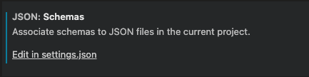
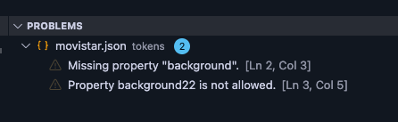
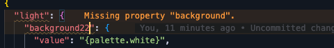

# Set up VScode with Mística JSON Schema validator

If you want to see formatting errors and disallowed rule violations in your .json token files, you need to configure VScode as follows:

1. Open the settings (cmd + ,)
2. Search for `Json` in the search bar
3. In the results, look for `JSON: Schemas`

   

4. Click on "Edit in settings.json."
5. Add the following to the settings file:

   ```json
   {
     "json.schemas": [
       {
         "fileMatch": "/Users/USER/YOUR-GITHUB-FOLDER/mistica-design/tokens/*.json",
         "url": "/Users/USER/YOUR-GITHUB-FOLDER/mistica-design/tokens/schema/skin-schema.json"
       }
     ]
   }
   ```

6. To view the type of error occurring in the file, open the panel `View → Problems (SHIFT + COMMAND + M)`

7. To verify that you have everything set up correctly, open any token file (e.g., tokens/movistar.json) and change the name of any constant. You should see something like this:

   

   You can also see an error in the mistake.

   
