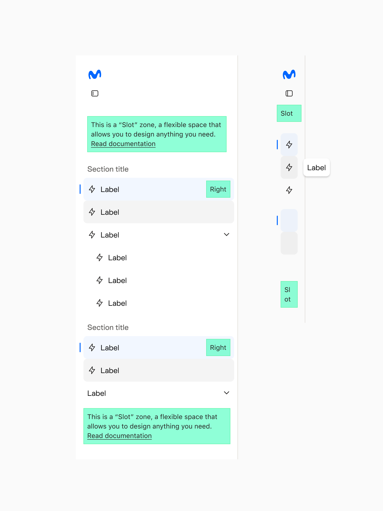
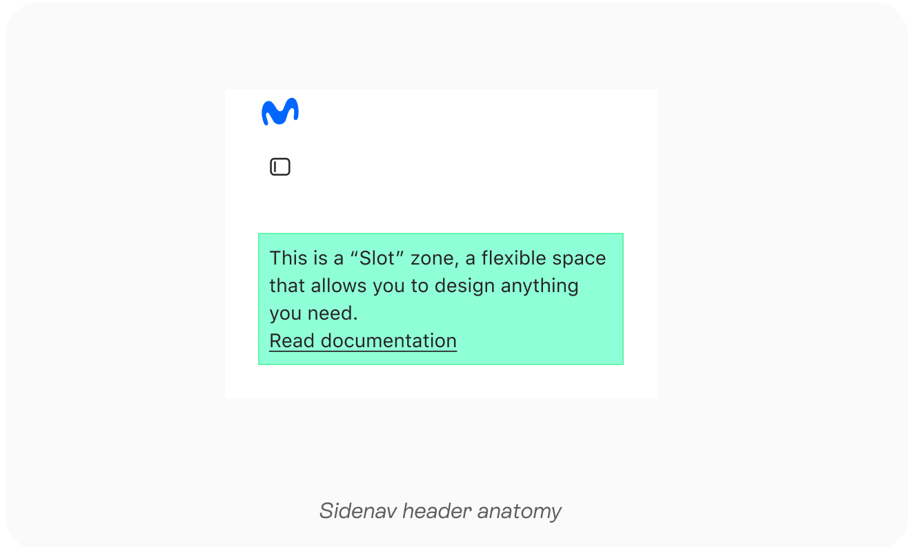
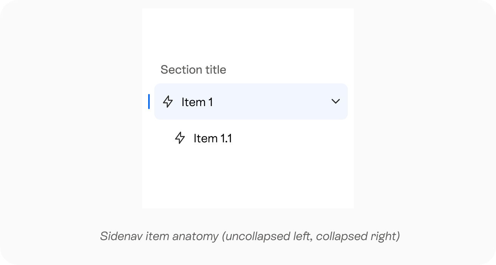
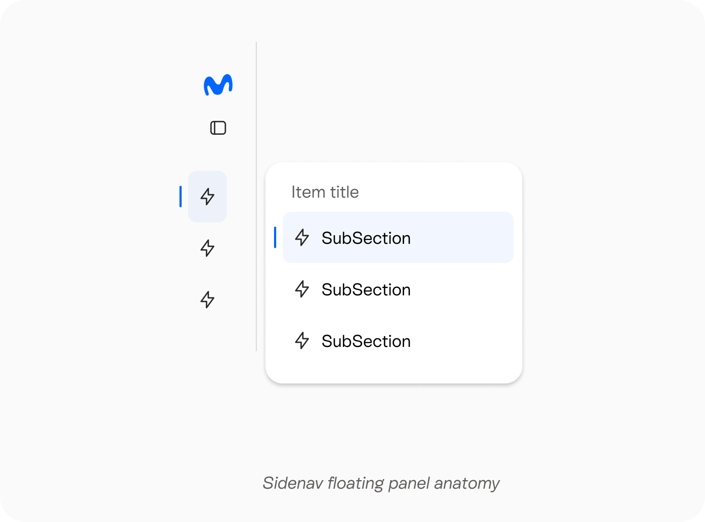
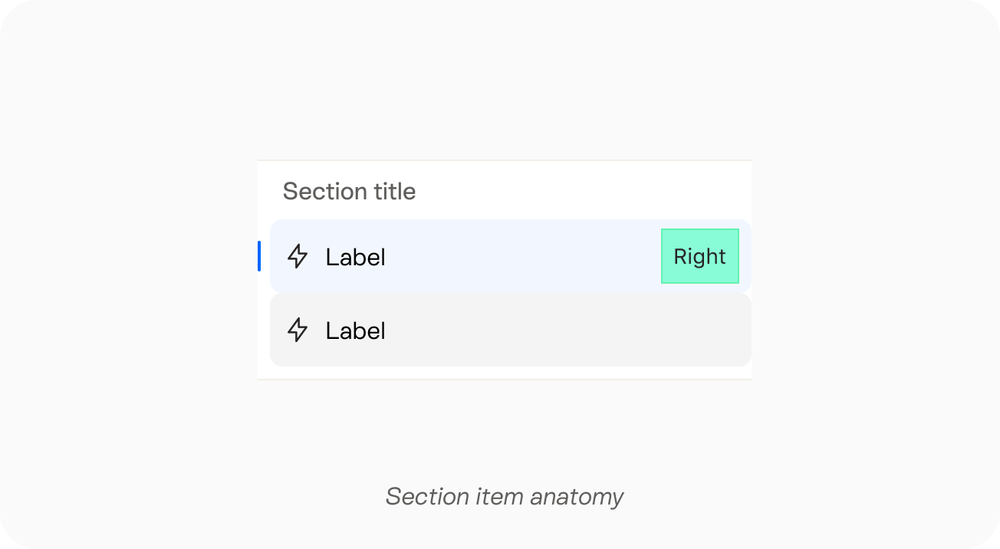
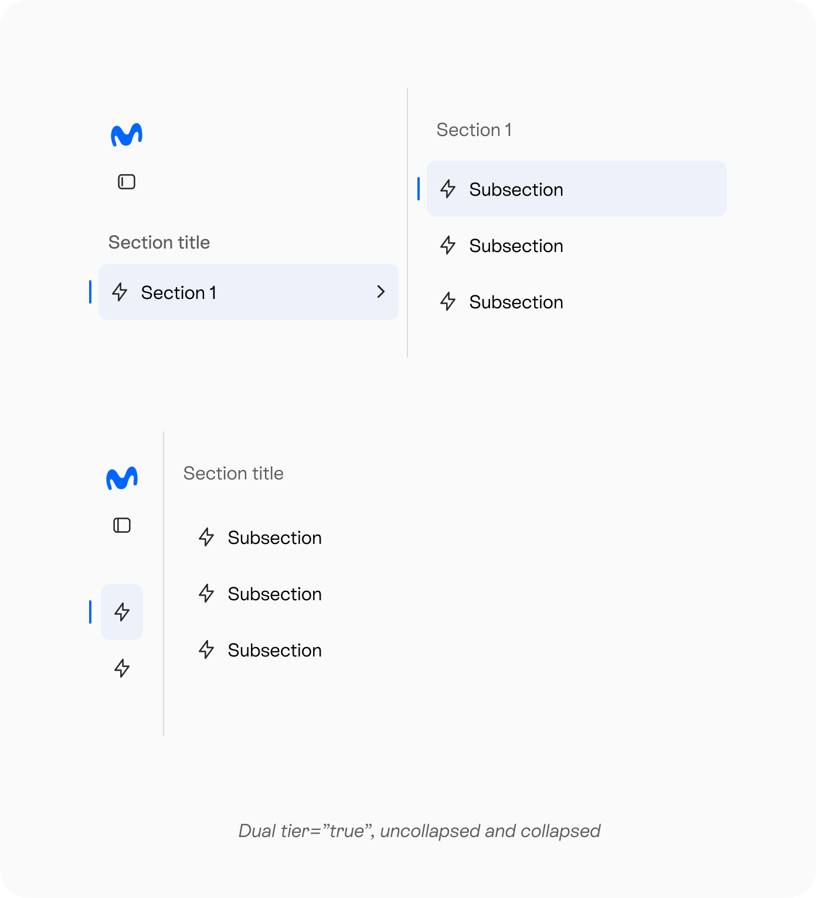
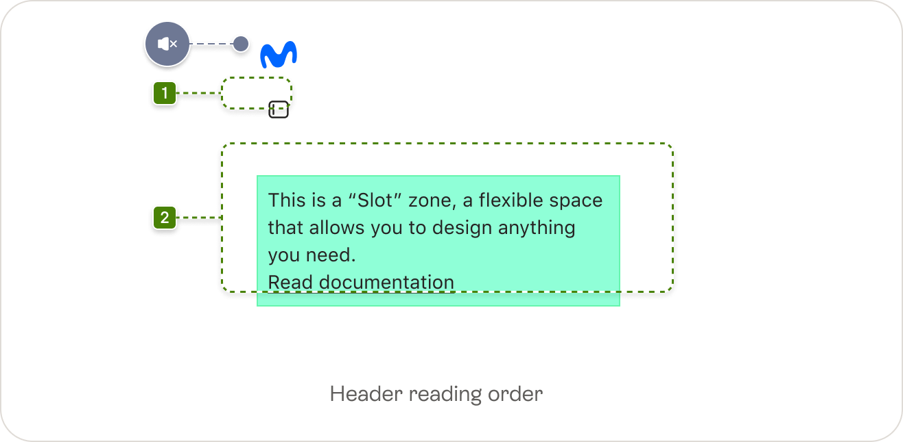
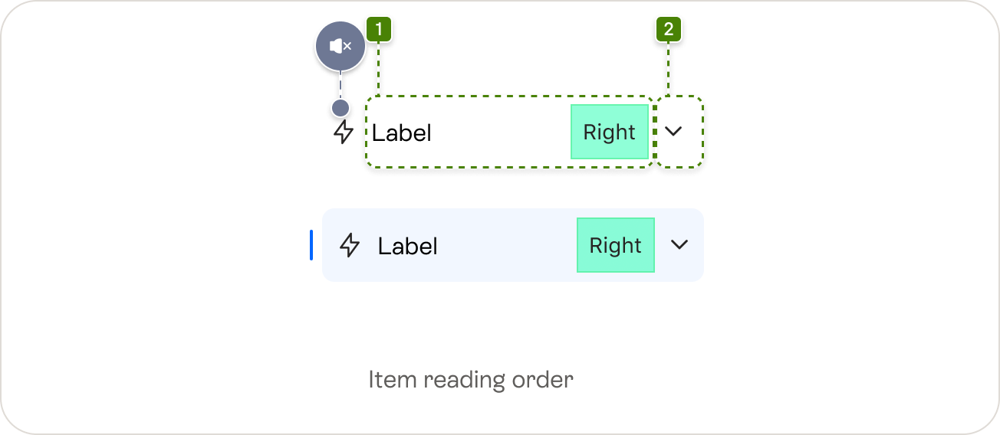

<!--
  Generated by scripts/figma-spec — do not edit by hand.
  component: sidenav
  fileKey:   SeC2Owe7FlB3eAhDYB82mQ
  pageId:    6510:13264
  generated: 2026-06-01T07:12:37.979Z
-->

# Sidenav

## Changelog

| Branch | Figma last modified | Generated |
| --- | --- | --- |
| main | 2026-06-01T07:07:36Z | 2026-06-01T07:09:57.070Z |
| main | 2026-05-22T08:09:25Z | 2026-05-22T08:13:17.467Z |
| main | 2026-05-22T07:48:20Z | 2026-05-22T07:53:53.815Z |
| main | 2026-05-22T07:46:43Z | 2026-05-22T07:47:43.211Z |
| main | 2026-05-07T07:02:04Z | 2026-05-07T07:08:31.673Z |

## Typology

### Sidenav regions

- header
- body
- footer

| Element | Space type | Value |
| --- | --- | --- |
| Top/bottom padding | padding | 24 |

### Header region

- Logo (Optional)
- Collapse/uncollapse action (Included via collapse prop, can be custom rendered)
- Slot

*Sidenav header anatomy*

| Element | Space type | Value(px) |
| --- | --- | --- |
| Header logo | width/height | 24 |
| Header to collapse icon button | gap | 8 |
| Collapse icon button to slot | gap | 32 |
| Header bottom padding | padding | 24 |
| Header width | width | full |
| Header left/right padding | padding | 16 |

### Body region

- Item sections
  - Section title
  - Items

#### Section

- Section title (Optional)
- Section divider top (Optional)
- Section divider bottom (Optional)
- Items

| Element | Space type | Value(px) |
| --- | --- | --- |
| Section title to items | gap | 8 |
| Section title x paddings | padding | 16 |
| Content to top/bottom dividers | gap | 16 |

#### Sidenav item

- Selected indicator: Appears only in the selected item
- Asset (Optional)
- Item label (Optional): when collapsed appears as a tooltip on the right of the element
- Right slot (Optional)
- Chevron: appears only in items with children

The item content area appears tinted when selected and also change color when hovered or pressed

*Sidenav item anatomy (uncollapsed left, collapsed right)*

| Element | Space type | Value(px) |
| --- | --- | --- |
| Selected indicator | height | 20 |
| Selected indicator | width | 2 |
| Selected indicator to content area | gap | 6 |
| Content area | padding left/right | 8 |
| Content area | height | 48 |
| Asset | width/height | 20 |
| Asset to label | gap | 8 |
| Label to right slot | gap | 8 |
| Right slot to chevron | gap | 8 |
| Chevron | width/height | 16 |

### Footer region

- Slot

*Sidenav item anatomy (uncollapsed left, collapsed right)*

### Floating panel

A floating panel that is used to show the children of an item when the sidenav is collapsed

*Sidenav floating panel anatomy*

| Element | Space type | Value(px) |
| --- | --- | --- |
| Item title to items | gap | 16 |
| Container top/bottom padding | padding | 16 |
| Container right/left padding | padding | 8 |
| Left gap with sidenav | margin | 8 |

### Double panel

A double panel can be shown if the second level of items is defined to appear in a panel

| Element | Space type | Value(px) |
| --- | --- | --- |
| Item title to items | gap | 16 |
| Container top/bottom padding | padding | 24 |
| Panel right/left padding | padding | 8 |

### Mobile

All sidenav is collapsed in a main navigation bar

Elements are mapped in the following way

logo → logo
Uncollapse → N/A
Header Slot → Bottom slot top
Items:
- Level 0: section        ← top entry (sidenav top item / burger root row)
- Level 1: column         ← collapsible group label (sidenav) / static label (burger submenu)
- Level 2: item           ← leaf, must be interactive
Footer → Bottom slot bottom

### Sidenav  + main navigation

When both elements are in the same ui, items should be collapsed together, the items from main navigation bar will be placed first  and the the idems coming from sidenav

*Section item anatomy*

## Behaviour

### Boxed

- Sidenav container can be defined as boxed, by default will be false
- Boxed=true variant cannot display right divider, since the box already works as separation

### Collapse / Uncollapse

- Sidenav can be defined as collapsed, this definition should support:
  - user can collapse or uncollapse, by default will be uncollapsed
  - true: is collapsed and cannot be changed
  - false: in not collapsed an cannot be changed
- Collapse action button wil be provided by default, but also allow a provider to paint this action as custom and with a different placing, so user can choose

### Dual tier

- Dual tier panel will open when user interacts with an element that has children (fig. 2)
- Dual tier panel will push content when open

*Dual tier=”true”, uncollapsed and collapsed*

### Sections

- A section can define if a divider appears and where (top, bottom or both), this helps dividing sections

### Items

- An item can be sected or not
- An item in a collapsed sidenav view should show label in a tooltip when hovered

### Item dropdowns

- Inside sections, an item can have children
- An item with children can be interactive
- When sidenav is collapsed the dropdown can be opened in the following ways
  - Dialog panel: a dialog opens near to the item trigger, showing children links
  - Full panel: a full panel appears attached to right of the sidenav, displaying all item children links

### Sidenav  + main navigation

When both elements are in the same ui, items should be collapsed together, the items from main navigation bar will be placed first  and the the idems coming from sidenav

### Sidenav Footer

- Appears at the bottom, uses the same definition as fixed footer when content goes underneath
- Can be configured as fixed, by default will scroll with all sidenav content

### Sidenav background and borders

- Sidenav background will be customizable (default variant backgrounds + custom color), should be possible to have it transparent...default?
- Sidenav should allow variant definition, so content changes by default
- Sidenav right divider should be configurable as “true | false”

### Sidenav width

- By default the sidenav will have a fixed width (280)
- Width can be overrided to any value (same as drawer)
- Collapsed width will be 72px

### Dual tier=”false”, uncollapsed and collapsed

### Right divider

- Sidenav will show a right divider by default, this divider can be hidden

### Scroll behaviour

- Sidenav will have its own scroll inside its container
- Header and footer can be defined as fixed, by default header will be fixed and footer will not
- When content goes underneath a divider appears in the intersection helping to

*Scroll behaviour: the divider appears when the content goes underneath*

### Layout

- The sidenav component will provide the layout for main content to behave correctly in all breakpoints
  - Layout can vary between taking the whole viewport or centered
- Users can either dedice to use the layout provided by sidenav or to place the sidenav in a custom layout

### Layout / Whole viewport

When the sidenav provides the layout for content and both take the whole viewport will follow the following:

| Breakpoint | Sidenav width (default) | Main content paddings | Main width |
| --- | --- | --- | --- |
| Mobile & Tablet | N/A | N/A | N/A |
| Desktop (1024–1919px) | 240px | 32 | auto |
| Large Desktop (≥1920px) | 280px | 64 (min) | 1512px |

### Layout / Centered

When the sidenav provides the layout for content and are centered, both will be included in a responsive layout container

| Breakpoint | Sidenav width (default) | sidenav / content gutter | Main width |
| --- | --- | --- | --- |
| Mobile & Tablet | N/A | N/A | N/A |
| Desktop (1024–1919px) | 240px | 32 | auto |
| Large Desktop (≥1920px) | 280px | 64 (min) | auto |

### Layout / Custom

The sidenav may be placed in any custom layout, so it should work as a single piece in desktop

## Tokens

### Default

| Element | Token / Color |
| --- | --- |
| body background | transparent |
| body background (Boxed) | backgroundContainer |

#### Header

| Element | Token / Color |
| --- | --- |
| header background | background |
| header background (Boxed) | backgroundContainer |
| overscroll divider | divider |

#### Section

| Element | Token / Color | Font-size | Line-height | Font-weight |
| --- | --- | --- | --- | --- |
| Section title | textSecondaryBrand | text3 | text3 | text3 |
| dividers | divider |  |  |  |

#### Item

| Element | Token / Color | Font-size | Line-height | Font-weight |
| --- | --- | --- | --- | --- |
| Selected indicator | controlActivated |  |  |  |
| Asset | currentColor |  |  |  |
| Label | textPrimary | text2 | text2 | text2 |
| background | transparent |  |  |  |
| background:hover | backgroundContainerHover |  |  |  |
| background:pressed | backgroundContainerPressed |  |  |  |
| background:selected | backgroundContainerSelected |  |  |  |
| background:selected:hover | backgroundContainerSelectedHover |  |  |  |
| background:selected:pressed | backgroundContainerSelectedPressed |  |  |  |
| chevron | neutralHigh |  |  |  |

#### Footer

| Element | Token / Color |
| --- | --- |
| footer background | background |
| footer background (Boxed) | backgroundContainer |
| overscroll divider | divider |

### Brand

| Element | Token / Color |
| --- | --- |
| body background | transparent |
| body background (Boxed) | backgroundContainerBrand |

#### Header

| Element | Token / Color |
| --- | --- |
| header background | backgroundBrandTop |
| header background(Boxed) | backgroundContainerBrand |
| overscroll divider | dividerBrand |

#### Section

| Element | Token / Color | Font-size | Line-height | Font-weight |
| --- | --- | --- | --- | --- |
| Section title | textSecondaryBrand | text3 | text3 | text3 |
| dividers | divider |  |  |  |

#### Item

| Element | Token / Color | Font-size | Line-height | Font-weight |
| --- | --- | --- | --- | --- |
| Selected indicator | controlActivatedBrand |  |  |  |
| Asset | currentColor |  |  |  |
| Label | textPrimaryBrand | text2 | text2 | text2 |
| background | transparent |  |  |  |
| background:hover | backgroundContainerBrandHover |  |  |  |
| background:pressed | backgroundContainerBrandPressed |  |  |  |
| background:selected | backgroundContainerSelected |  |  |  |
| background:selected:hover | backgroundContainerSelectedHover |  |  |  |
| background:selected:pressed | backgroundContainerSelectedPressed |  |  |  |
| chevron | neutralHighBrand |  |  |  |

#### Footer

| Element | Token / Color |
| --- | --- |
| footer background | backgroundBrandTop |
| footer background(Boxed) | backgroundContainerBrand |
| overscroll divider | dividerBrand |

### Alternative

| Element | Token / Color |
| --- | --- |
| body background | transparent |
| body background (Boxed) | backgroundContainerAlternative |

#### Header

| Element | Token / Color |
| --- | --- |
| header background | background |
| header background (Boxed) | backgroundContainerAlternative |
| overscroll divider | divider |

#### Section

| Element | Token / Color | Font-size | Line-height | Font-weight |
| --- | --- | --- | --- | --- |
| Section title | textSecondaryBrand | text3 | text3 | text3 |
| dividers | divider |  |  |  |

#### Item

| Element | Token / Color | Font-size | Line-height | Font-weight |
| --- | --- | --- | --- | --- |
| Selected indicator | controlActivated |  |  |  |
| Asset | currentColor |  |  |  |
| Label | textPrimary | text2 | text2 | text2 |
| background | transparent |  |  |  |
| background:hover | backgroundContainerHover |  |  |  |
| background:pressed | backgroundContainerPressed |  |  |  |
| background:selected | backgroundContainerSelected |  |  |  |
| background:selected:hover | backgroundContainerSelectedHover |  |  |  |
| background:selected:pressed | backgroundContainerSelectedPressed |  |  |  |
| chevron | neutralHigh |  |  |  |

#### Footer

| Element | Token / Color |
| --- | --- |
| footer background | background |
| footer background (Boxed) | backgroundContainerAlternative |
| overscroll divider | divider |

### Negative

| Element | Token / Color |
| --- | --- |
| body background | transparent |
| body background (Boxed) | backgroundContainerNegative |

#### Header

| Element | Token / Color |
| --- | --- |
| header background | backgroundNegative |
| header background (Boxed) | backgroundContainerNegative |
| overscroll divider | dividerNegative |

#### Section

| Element | Token / Color | Font-size | Line-height | Font-weight |
| --- | --- | --- | --- | --- |
| Section title | textSecondaryNegative | text3 | text3 | text3 |
| dividers | dividerNegative |  |  |  |

#### Item

| Element | Token / Color | Font-size | Line-height | Font-weight |
| --- | --- | --- | --- | --- |
| Selected indicator | controlActivatedNegative |  |  |  |
| Asset | currentColor |  |  |  |
| Label | textPrimaryNegative | text2 | text2 | text2 |
| background | transparent |  |  |  |
| background:hover | backgroundContainerNegativeHover |  |  |  |
| background:pressed | backgroundContainerNegativePressed |  |  |  |
| background:selected | backgroundContainerSelected |  |  |  |
| background:selected:hover | backgroundContainerSelectedHover |  |  |  |
| background:selected:pressed | backgroundContainerSelectedPressed |  |  |  |
| chevron | neutralHighNegative |  |  |  |

#### Footer

| Element | Token / Color |
| --- | --- |
| footer background | backgroundNegative |
| footer background (Boxed) | backgroundContainerNegative |
| overscroll divider | dividerNegative |

### Media

| Element | Token / Color |
| --- | --- |
| body background | transparent |
| body background (Boxed) | backgroundContainerNegative |

#### Header

| Element | Token / Color |
| --- | --- |
| header background | backgroundNegative |
| header background (Boxed) | backgroundContainerNegative |
| overscroll divider | dividerNegative |

#### Section

| Element | Token / Color | Font-size | Line-height | Font-weight |
| --- | --- | --- | --- | --- |
| Section title | textSecondaryNegative | text3 | text3 | text3 |
| dividers | dividerNegative |  |  |  |

#### Item

| Element | Token / Color | Font-size | Line-height | Font-weight |
| --- | --- | --- | --- | --- |
| Selected indicator | controlActivatedNegative |  |  |  |
| Asset | currentColor |  |  |  |
| Label | textPrimaryNegative | text2 | text2 | text2 |
| background | transparent |  |  |  |
| background:hover | backgroundContainerNegativeHover |  |  |  |
| background:pressed | backgroundContainerNegativePressed |  |  |  |
| background:selected | backgroundContainerSelected |  |  |  |
| background:selected:hover | backgroundContainerSelectedHover |  |  |  |
| background:selected:pressed | backgroundContainerSelectedPressed |  |  |  |
| chevron | neutralHighNegative |  |  |  |

#### Footer

| Element | Token / Color |
| --- | --- |
| footer background | backgroundNegative |
| footer background (Boxed) | backgroundContainerNegative |
| overscroll divider | dividerNegative |

### Floating panel

| Element | Token / Color | Font-size | Line-height | Font-weight |
| --- | --- | --- | --- | --- |
| container background | backgroundContainer |  |  |  |
| title | textSecondary | text3 | text3 | text3 |

## Accessibility

### General

- Navigation items should be semantically defined as a navigation
- Navigation items that have children should give the user information about their expand and collapse behaviour
- Items should allow to include an accessible name, this should be mandatory when sidenav is collapsed
- When Items that navigate and have children Two focus stop should be included in this items, one to collapse/uncollapse and another to navigate

### Reading order

#### Header

1. Icon button (collapse/uncollapse)
1. Slot elements: should be announced in visual order

#### Item

1. [Concatenate the following elements]
  1. Label
  1. Slot elements: should be announced in visual order
1. Icon button (Collapse/uncollapse) (if present)

### Default labels

*Header reading order*

*Item reading order*
