<!--
  Generated by scripts/figma-spec — do not edit by hand.
  component: sidenav
  fileKey:   4woEBHpukbLVkmk9UJTGUD
  pageId:    6510:13264
  generated: 2026-08-07T18:26:50.752Z
-->

# Sidenav

## Changelog

| Branch | Figma last modified  | Generated                |
| ------ | -------------------- | ------------------------ |
| main   | 2026-08-07T18:17:35Z | 2026-08-07T18:26:50.752Z |
| Branch | Figma last modified  | Generated                |
| main   | 2026-08-07T18:17:35Z | 2026-08-07T18:25:07.021Z |
| Branch | Figma last modified  | Generated                |
| main   | 2026-08-07T18:17:35Z | 2026-08-07T18:18:14.317Z |
| main   | 2026-08-03T07:30:31Z | 2026-08-03T07:51:45.334Z |
| main   | 2026-07-10T12:51:51Z | 2026-07-13T06:42:10.329Z |
| main   | 2026-07-07T11:52:21Z | 2026-07-07T11:53:03.116Z |
| main   | 2026-07-07T11:47:22Z | 2026-07-07T11:47:59.902Z |
| main   | 2026-06-01T07:07:36Z | 2026-06-01T07:09:57.070Z |
| main   | 2026-05-22T08:09:25Z | 2026-05-22T08:13:17.467Z |
| main   | 2026-05-22T07:48:20Z | 2026-05-22T07:53:53.815Z |
| main   | 2026-05-22T07:46:43Z | 2026-05-22T07:47:43.211Z |
| main   | 2026-05-07T07:02:04Z | 2026-05-07T07:08:31.673Z |

## Typology

### Default

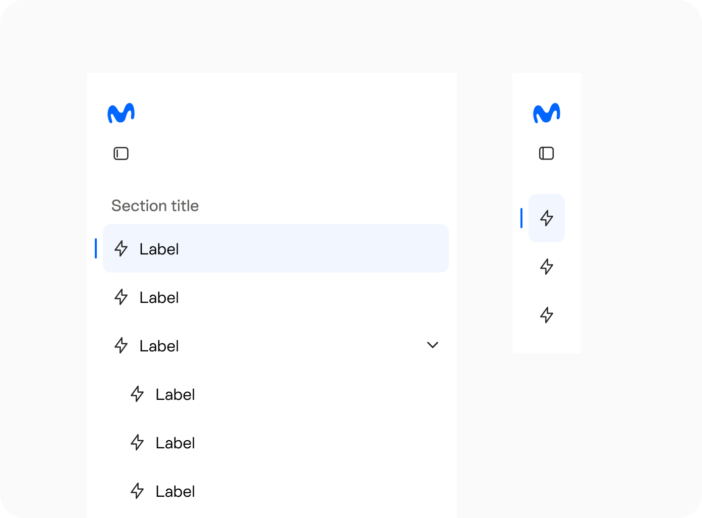

### Boxed

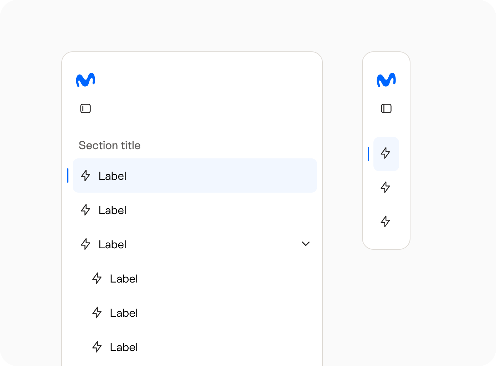

## Anatomy

### Container

- By default, the sidenav has a fixed width.
- Width can be overridden to any value (same as drawer).
- The right divider is vertical and spans the full height of the sidenav.
- Collapsed state can be set as the initial state.
- It is possible to use ONLY collapsed state with no expand option (prop: collapsible=false).

| Element                  | Space type | Value |
| ------------------------ | ---------- | ----- |
| Width (default)          | width      | 240   |
| Width (collapsed)        | width      | 72    |
| Right divider (optional) | height     | 100%  |

### Boxed container

- The sidenav can be displayed as a floating box (boxed). False by default.
- Incompatible with the right divider (the box already acts as separation).

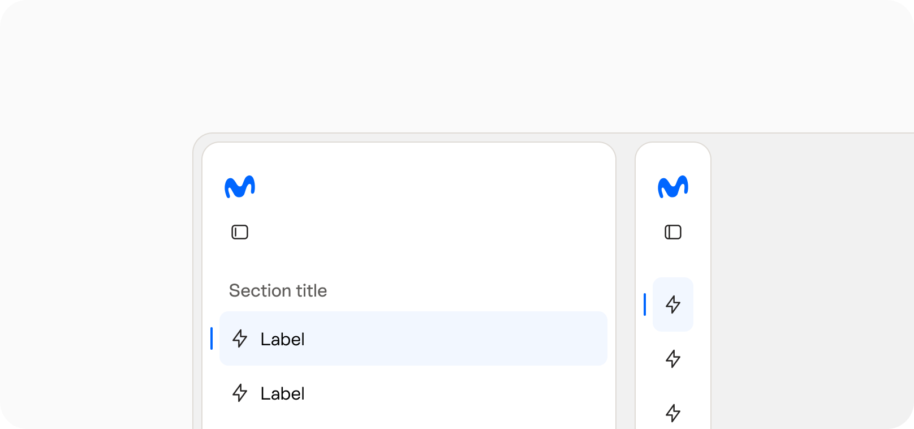

| Element                                    | Space type | Value/token                 |
| ------------------------------------------ | ---------- | --------------------------- |
| Border radius                              | radius     | popup                       |
| Inset                                      | margin     | 8                           |
| Height                                     | height     | 100% − (inset top + bottom) |
| Sidenav container                          | width      | 240-8px                     |
| Border (Optional)                          | width      | 1                           |
| You can view the full elevation specs here |            |                             |

### Sidenav regions

- header
- body
- footer

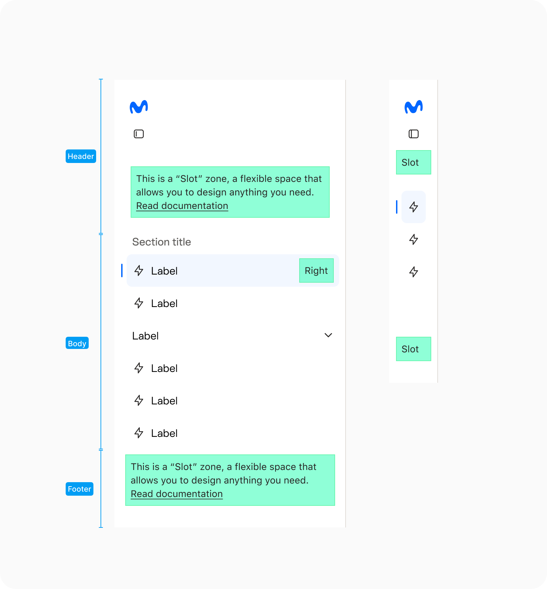

### Header region

- Logo (Optional)
- Collapse/uncollapse action (Included via collapse prop, can be custom rendered)
  - Action will use an IconButton component type=”neutral” background=”transparent”
- Header slot (Optional)

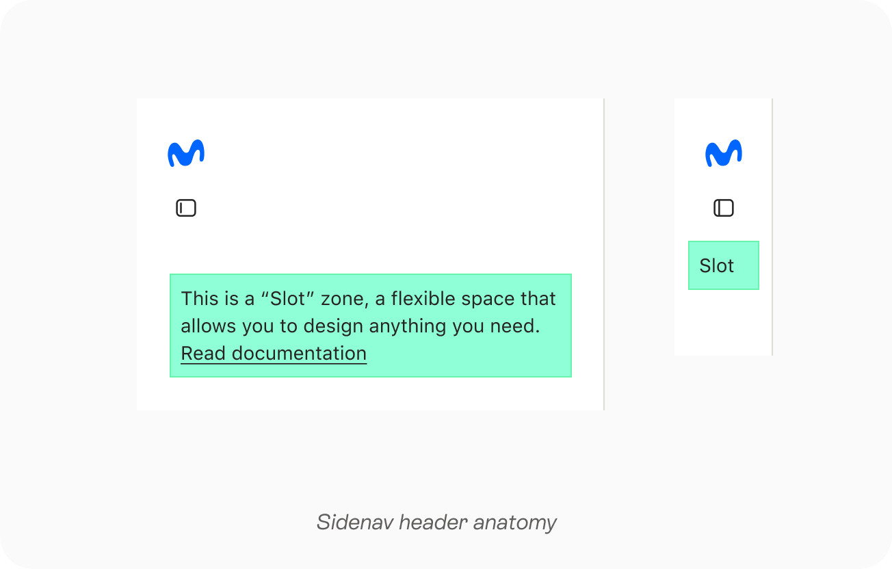

_Sidenav header anatomy_

| Element                       | Space type   | Value(px) |
| ----------------------------- | ------------ | --------- |
| Top/bottom padding            | padding      | 24        |
| Right padding                 | padding      | 24        |
| Left padding to logo          | padding      | 20        |
| Logo                          | width/height | 40        |
| Left padding to collapse icon | padding      | 20        |
| Gap logo to collapse icon     | gap          | 8         |
| Collapse icon                 | width/height | 32        |
| Gap collapse icon to slot     | gap          | 32        |
| Gap logo to collapse icon     | gap          | 8         |
| Gap collapse icon to slot     | gap          | 32        |

#### Section

- Section divider top (Optional)
- Section title (Optional)
- Items
- Section divider bottom (Optional)

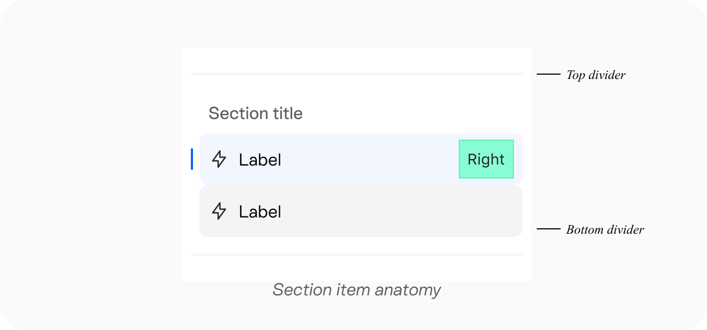

_Section item anatomy_

| Element                        | Space type | Value(px)                             |
| ------------------------------ | ---------- | ------------------------------------- |
| Section title to items         | gap        | 8                                     |
| Section title x paddings       | padding    | 16                                    |
| Content to top/bottom dividers | gap        | 8                                     |
| Top/bottom dividers            | width      | full width (of the section container) |

#### Sidenav item

- Selected indicator: Appears only in the selected item
- Asset: Optional when expanded, but required when the sidenav is collapsed (it is the only element shown in the collapsed view).
- Item label (Optional): when collapsed appears as a tooltip on the right of the element
- Right slot (Optional). Will be hidden when collapsed
- Chevron: appears only in items with children

The item content area appears tinted when selected and also change color when hovered or pressed

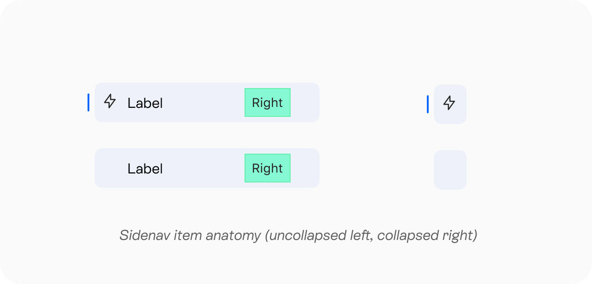

_Sidenav item anatomy (uncollapsed left, collapsed right)_

| Element                            | Space type         | Value(px)             |
| ---------------------------------- | ------------------ | --------------------- |
| Selected indicator                 | height             | 20                    |
| Selected indicator                 | width              | 2                     |
| Selected indicator to content area | gap                | 6                     |
| Content area                       | padding left/right | 8                     |
| Content area                       | height             | 44 desktop /48 mobile |
| Asset                              | width/height       | 20                    |
| Asset to label                     | gap                | 8                     |
| Label to right slot                | gap                | 8                     |
| Right slot to chevron              | gap                | 8                     |
| Chevron                            | width/height       | 16                    |

#### Item with children

An item can contain nested items.

- A 1st-level item with children only expands (it does not navigate).
- A 1st-level item without children navigates directly.
- A 2nd-level item (child) navigates and in double panel mode this also closes the panel.

Each nesting level is cumulative and indents the whole item relative to the previous level. Indentation applies to the item container, so it behaves consistently whether or not the item has an asset.

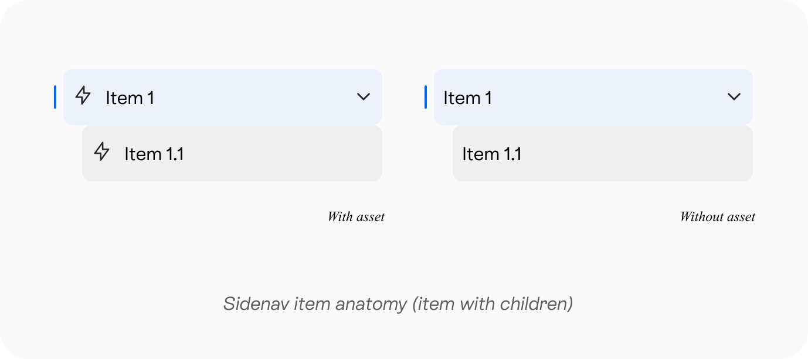

_With asset Without asset Sidenav item anatomy (item with children)_

| Element                         | Space type   | Value(px) |
| ------------------------------- | ------------ | --------- |
| Nesting indentation (per level) | padding-left | 24        |

#### Section

- Slot (Optional)

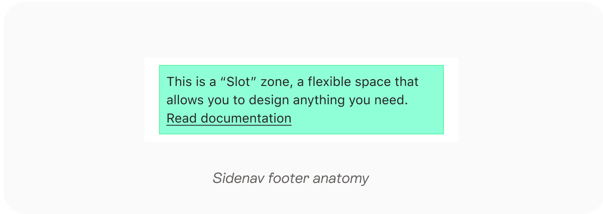

_Sidenav footer anatomy_

| Element          | Space type | Value(px) |
| ---------------- | ---------- | --------- |
| Slot top padding | padding    | 8         |

### Dialog panel

A floating panel that is used to show the children of an item when the sidenav is collapsed, whenever is possible the panel will be anchored to the top of the trigger, matching the trigger and the first children item in the same height.

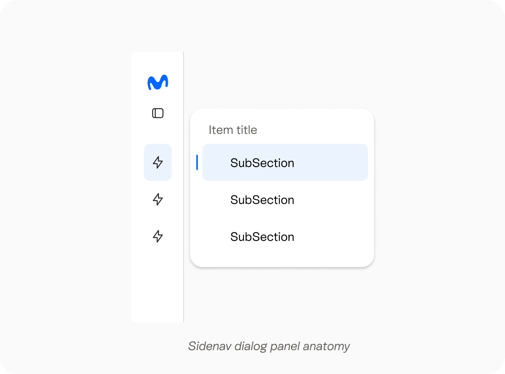

_Sidenav floating panel anatomy_

| Element                      | Space type | Value(px) |
| ---------------------------- | ---------- | --------- |
| Section title to items       | gap        | 8         |
| Container top/bottom padding | padding    | 16        |
| Container right/left padding | padding    | 8         |
| Left gap with sidenav        | margin     | 8         |

> See also: The dialog panel follows the specifications of the Menu component. You can view full specs [here](https://www.figma.com/design/a1pgrI7Wg41iyXWU8ETqlU/%F0%9F%94%B8-Menu-Specs?node-id=1703-724&t=vwLOWfP1Om9sVVnH-4)

### Double panel

A double panel can be shown if the second level of items is defined to appear in a panel, the chevron will point to the right instead of bottom when children are in second panel.

Panel behavior
The trigger (pressing a 1st-level item with children) opens the panel.
The panel closes if:

- I press a 2nd-level item
- I press outside
- I press the same 1st-level item again (toggle)
- I press another 1st-level item without children
  The panel refreshes if:
- I press another 1st-level item with children

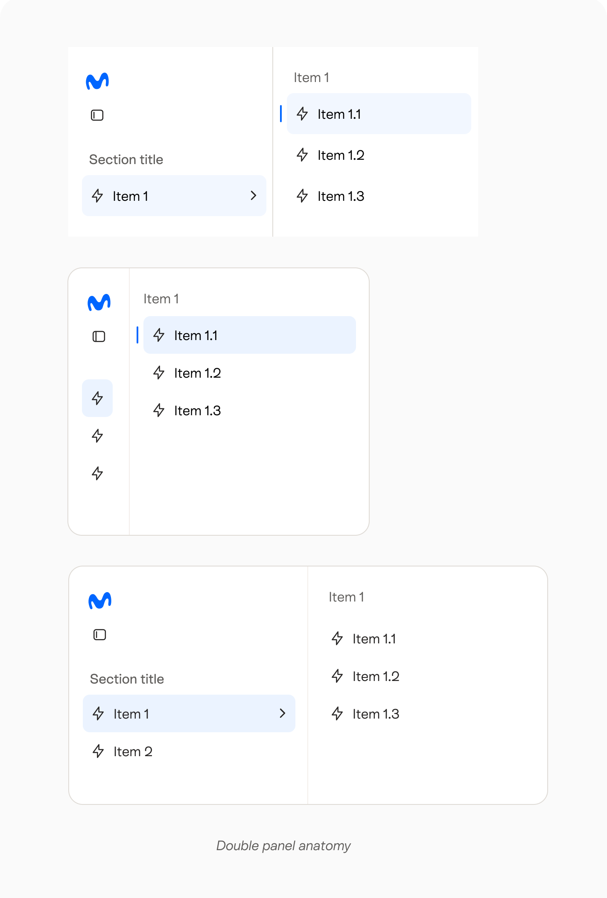

_Double panel anatomy_

| Element                      | Space type | Value(px)                              |
| ---------------------------- | ---------- | -------------------------------------- |
| Item title to items          | gap        | 16                                     |
| Container top/bottom padding | padding    | 24                                     |
| Panel right/left padding     | padding    | 8                                      |
| Width panel                  | width      | 240 (Same as sidenav panel main width) |

### Mobile

On mobile, the Sidenav collapses following the same behavior as the Main Navigation Bar.
Element mapping:

- Burger menu: Opens/closes body panel
- Logo: Remains in top bar
- Uncollapse: N/A
- Header Slot: Integrated in top slot area
- Footer: Integrated at slot bottom of panel
- Body items: Display inside the panel (same hierarchy)
- Item Hierarchy in Panel:• Level 0: Main entry (appears in burger menu) • Level 1: Group label/ Category (can expand) • Level 2: Interactive element (leaf, navigable)

For animation details use the same as the production component for consistency.

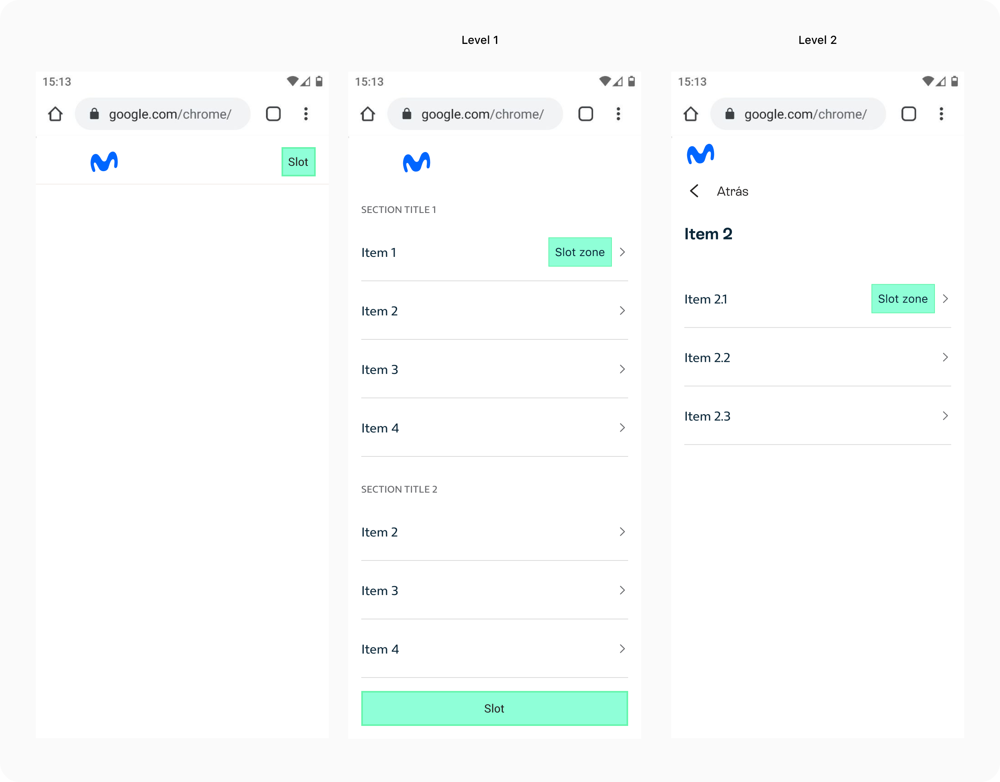

_Level 1 Level 0 Level 2_

> See also: You can view the full MainNavBar specs [here](https://www.figma.com/design/Os5UfsnhLtQ9rnzmtcX8J4/%F0%9F%94%B8-Navigation-Bar-Specs?node-id=1206-2534)

## Behaviour

### Boxed

- Sidenav container can be defined as boxed, by default will be false.
- Boxed variant cannot display right divider, since the box already works as separation.

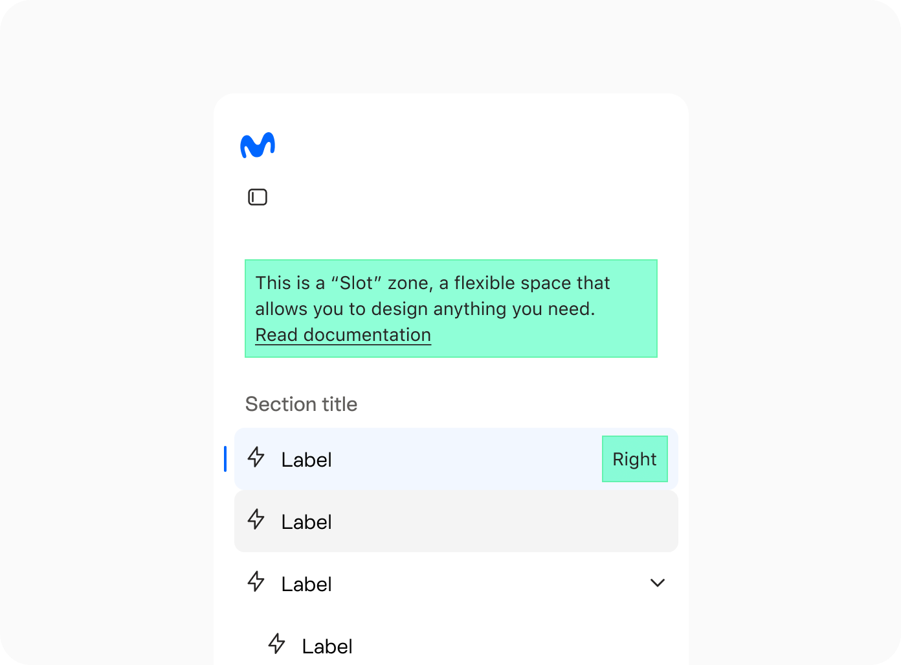

### Collapse / Uncollapse

- Sidenav can be defined as collapsed, this definition should support:
  - user can collapse or uncollapse, by default will be uncollapsed
  - true: is collapsed and cannot be changed
  - false: is not collapsed and cannot be changed
- Collapse action button will be provided by default, but also allow a provider to paint this action as custom and with a different placing, so user can choose.

### Double panel

- Double panel will open when user interacts with an element that has children.
- Double panel will push content when open.
- If right divider is true will be shown in the double panel
- Bay default will inheritate the same width as defined for main sidenav panel unless explicitly defined other width

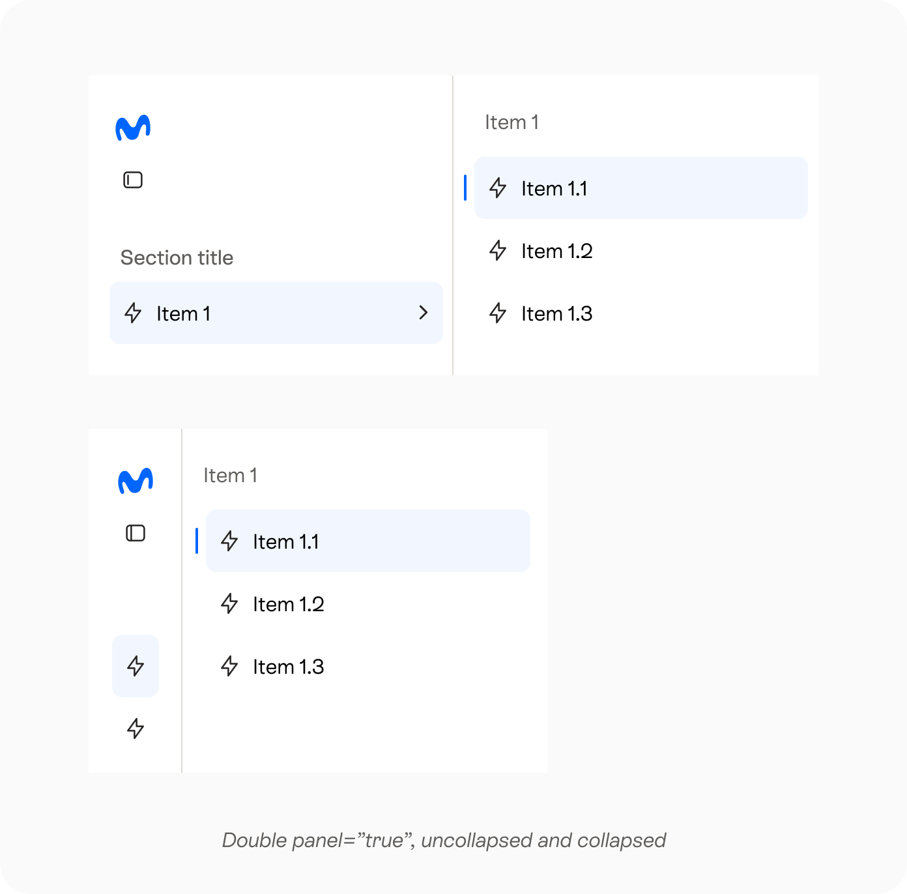

_Double panel=”true”, uncollapsed and collapsed_

### Sections

A section can be defined in two ways:

- with section title only
- with divider only (top, bottom, or both)

The divider is independent from the section title.

Section with children:
Expanded state: the section title is shown + optional divider.
Collapsed state: the section title is hidden (reserving its space) and the divider remains visible if defined.
Divider consistency: the divider must be the same in both states (expanded/collapsed).

### Items

- An item can be sectioned or not (it may belong to a section or stand alone).
- An item in a collapsed sidenav view should show label in a tooltip when hovered.

### Item dropdowns

- Inside sections, an item can have children.
- An item with children can be interactive. When an item has children but also navigates, it will navigate and show its children at the same time.
- Items with children can be defined as open by default, when the sidenav is collapsed, all parent items should appear closed.
- When sidenav is collapsed the dropdown can be opened in the following ways:
  - Dialog panel: a dialog opens near to the item trigger, showing children links
  - Double panel: a full panel appears attached to right of the sidenav, displaying all item children links
- The sidenav will allow only 1 children level, a children item cannot have any nested level inside

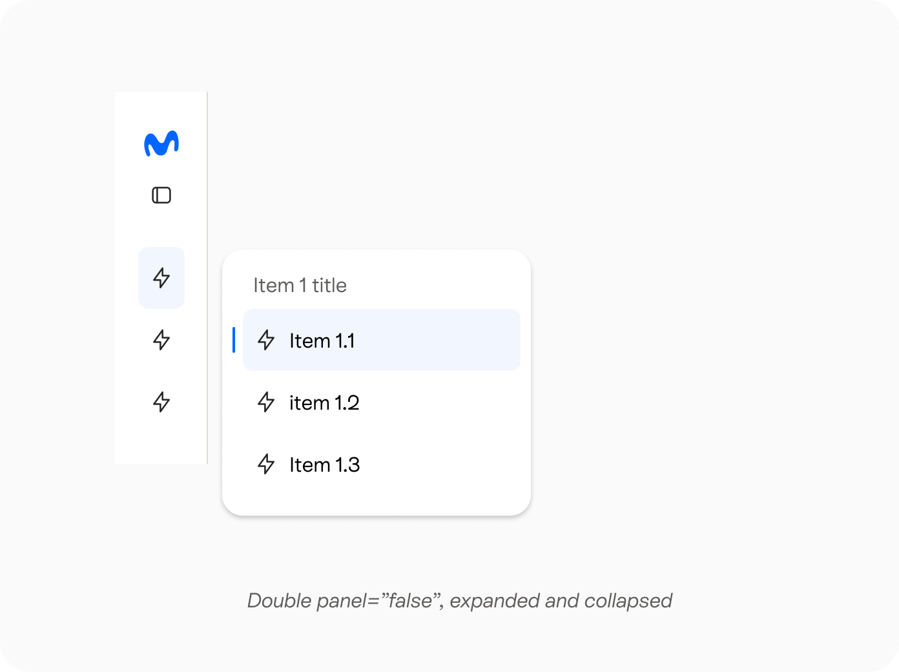

_Double panel=”false”, uncollapsed and collapsed_

### Sidenav Footer

- Appears at the bottom, uses the same definition as fixed footer when content goes underneath.
- Can be configured as fixed, by default will scroll with all sidenav content.

### Right divider

- Visible by default; configurable as true | false.
- Boxed = true cannot display the right divider, since the box already works as separation.

### Background

- The Sidenav background is customizable: it supports default variant backgrounds as well as a custom color, including transparent.
- Sidenav supports variant definition that updates the content appearance automatically.
- The body background will be defined in tokens section.
- The header and footer backgrounds cannot be transparent, since content scrolls underneath them when fixed and an opaque background is required to mask it.

### Scroll behaviour

- Sidenav will have its own scroll inside its container
- Header and footer can be defined as fixed, by default header will be fixed and footer will not
- When content goes underneath, a divider appears at the intersection to indicate that the content continues below.

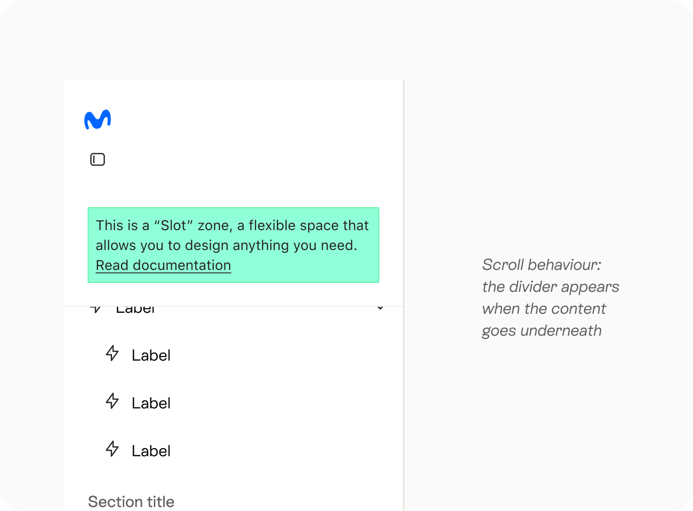

_Scroll behaviour: the divider appears when the content goes underneath_

### Layout

- The sidenav component will provide the layout for main content to behave correctly in all breakpoints.
- Layout can vary between taking the whole viewport or centered.
- Users can either decide to use the layout provided by sidenav or to place the sidenav in a custom layout.

#### Whole viewport

When the sidenav provides the layout for content and both take the whole viewport will follow the following:

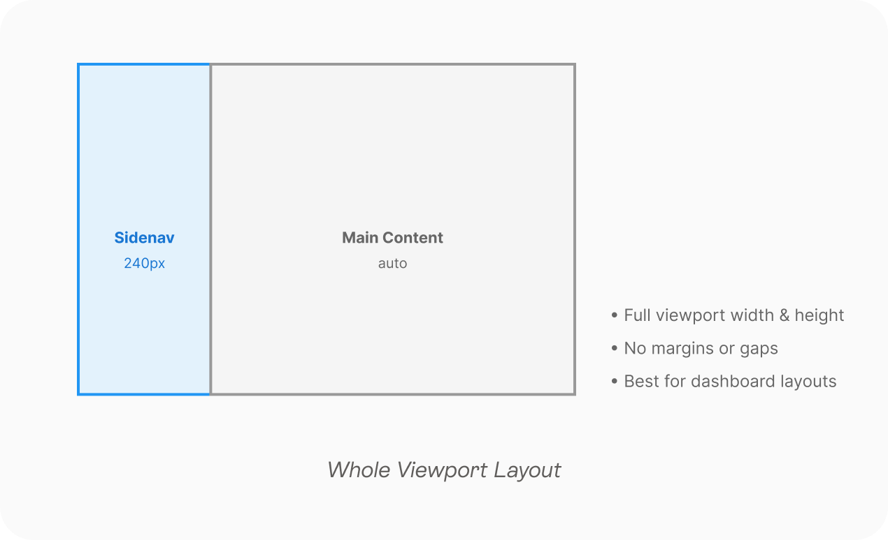

_Whole Viewport Layout_

| Breakpoint              | Sidenav width (default) |
| ----------------------- | ----------------------- |
| Mobile & Tablet         | N/A                     |
| Desktop (1024–1919px)   | 240px                   |
| Large Desktop (≥1920px) | 296px                   |

#### Centered

When the sidenav provides the layout for content and are centered, both will be included in the responsive layout container.

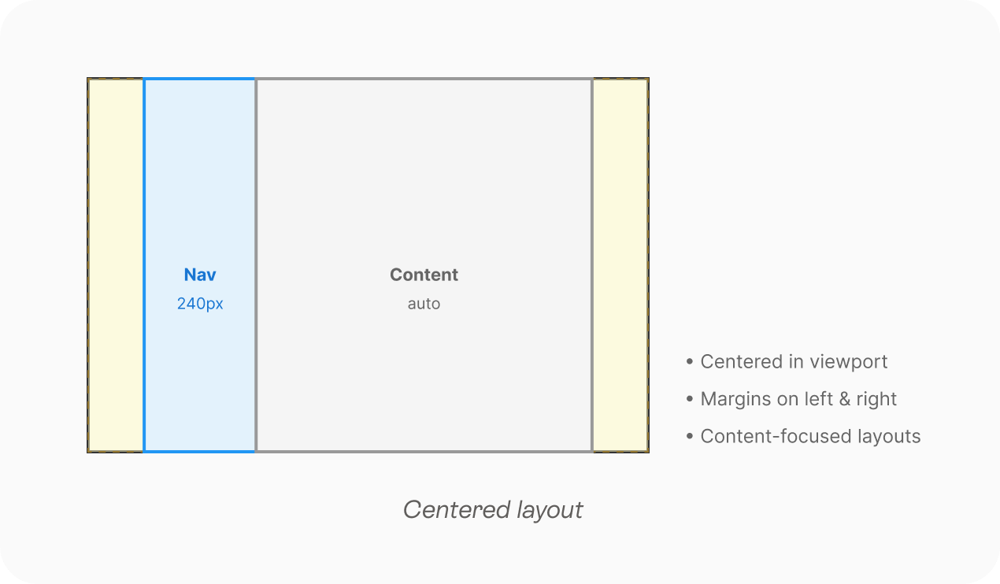

_Centered layout_

| Breakpoint              | Sidenav width (default) |
| ----------------------- | ----------------------- |
| Mobile & Tablet         | N/A                     |
| Desktop (1024–1919px)   | 240px                   |
| Large Desktop (≥1920px) | 296px                   |

#### Burger Menu

- The burger menu open/close behavior emulates the Main Navigation Bar component.
- For animation details use the sames as the production component for consistency.

> See also: You can view the full MainNavBar specs [here](https://www.figma.com/design/Os5UfsnhLtQ9rnzmtcX8J4/%F0%9F%94%B8-Navigation-Bar-Specs?node-id=1206-2534)

## Tokens

### Default

| Element                 | Token / Color       |
| ----------------------- | ------------------- |
| body background         | backgroundContainer |
| body background (Boxed) | backgroundContainer |
| right divider           | divider             |

#### Header

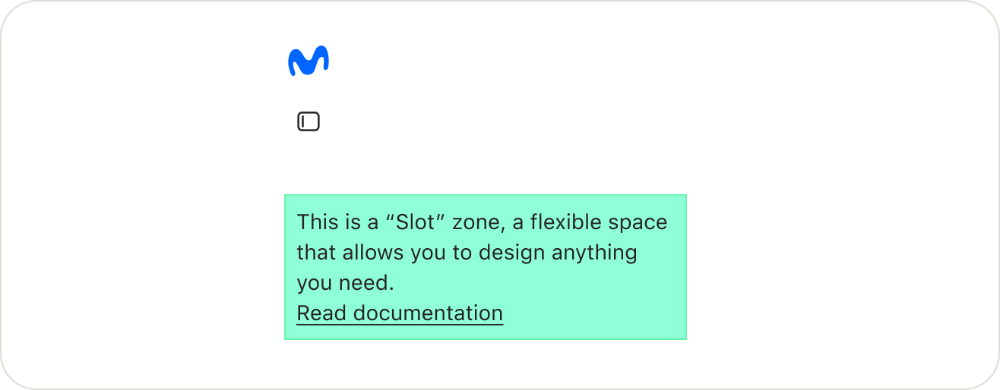

| Element                   | Token / Color       |
| ------------------------- | ------------------- |
| header background         | background          |
| header background (Boxed) | backgroundContainer |
| overscroll divider        | divider             |

#### Section

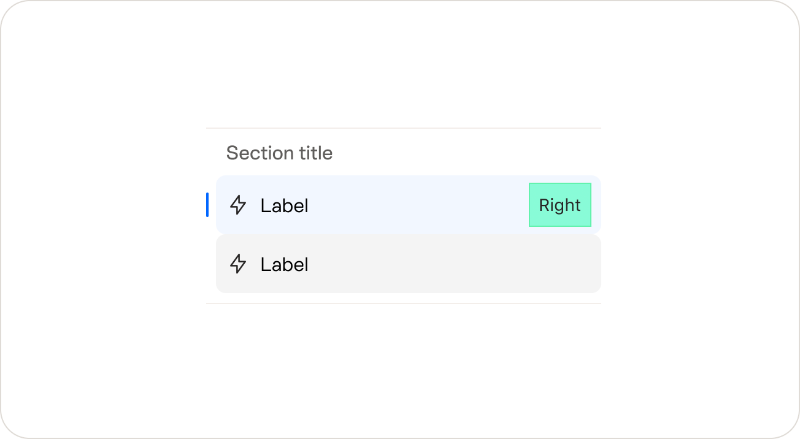

| Element       | Token / Color      | Font-size | Line-height | Font-weight |
| ------------- | ------------------ | --------- | ----------- | ----------- |
| Section title | textSecondaryBrand | text3     | text3       | text3       |
| dividers      | divider            |           |             |             |

#### Item

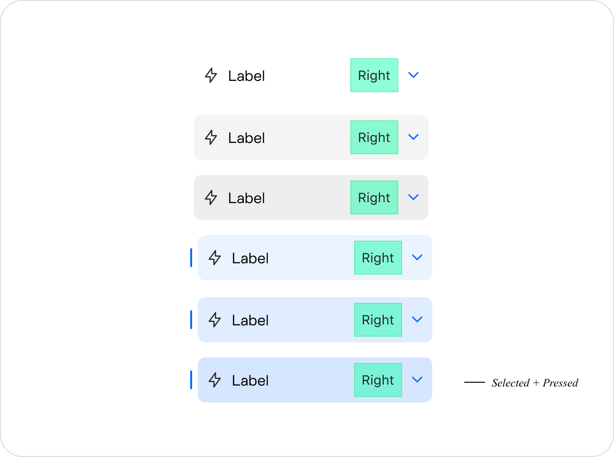

| Element                     | Token / Color              | Font-size | Line-height | Font-weight |
| --------------------------- | -------------------------- | --------- | ----------- | ----------- |
| Selected indicator          | controlActivated           |           |             |             |
| Asset                       | currentColor               |           |             |             |
| Label                       | textPrimary                | text2     | text2       | text2       |
| background                  | transparent                |           |             |             |
| background:hover            | backgroundContainerHover   |           |             |             |
| background:pressed          | backgroundContainerPressed |           |             |             |
| background:selected         | backgroundSelected         |           |             |             |
| background:selected:hover   | backgroundSelectedHover    |           |             |             |
| background:selected:pressed | backgroundSelectedPressed  |           |             |             |
| chevron                     | neutralHigh                |           |             |             |

#### Footer

| Element                   | Token / Color       |
| ------------------------- | ------------------- |
| footer background         | background          |
| footer background (Boxed) | backgroundContainer |
| overscroll divider        | divider             |

### Brand

| Element                 | Token / Color            |
| ----------------------- | ------------------------ |
| body background         | transparent              |
| body background (Boxed) | backgroundContainerBrand |
| right divider           | dividerBrand             |

#### Header

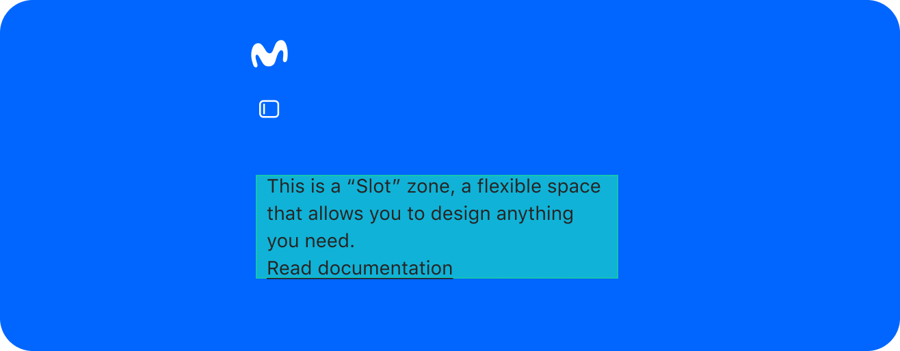

| Element                  | Token / Color            |
| ------------------------ | ------------------------ |
| header background        | backgroundBrandTop       |
| header background(Boxed) | backgroundContainerBrand |
| overscroll divider       | dividerBrand             |

#### Section

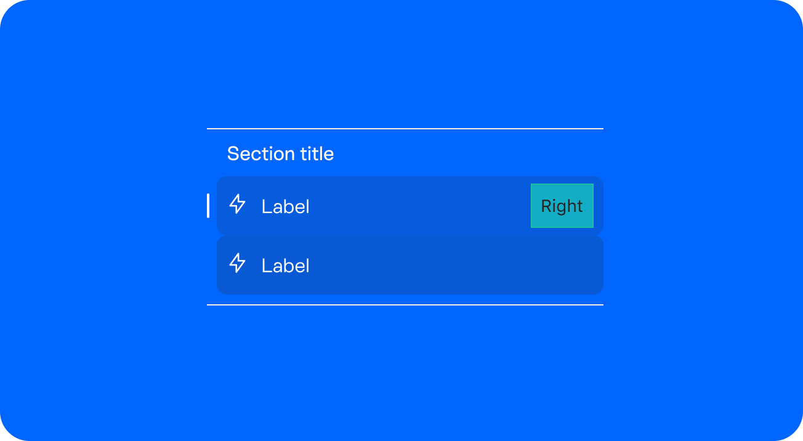

| Element       | Token / Color      | Font-size | Line-height | Font-weight |
| ------------- | ------------------ | --------- | ----------- | ----------- |
| Section title | textSecondaryBrand | text3     | text3       | text3       |
| dividers      | divider            |           |             |             |

#### Item

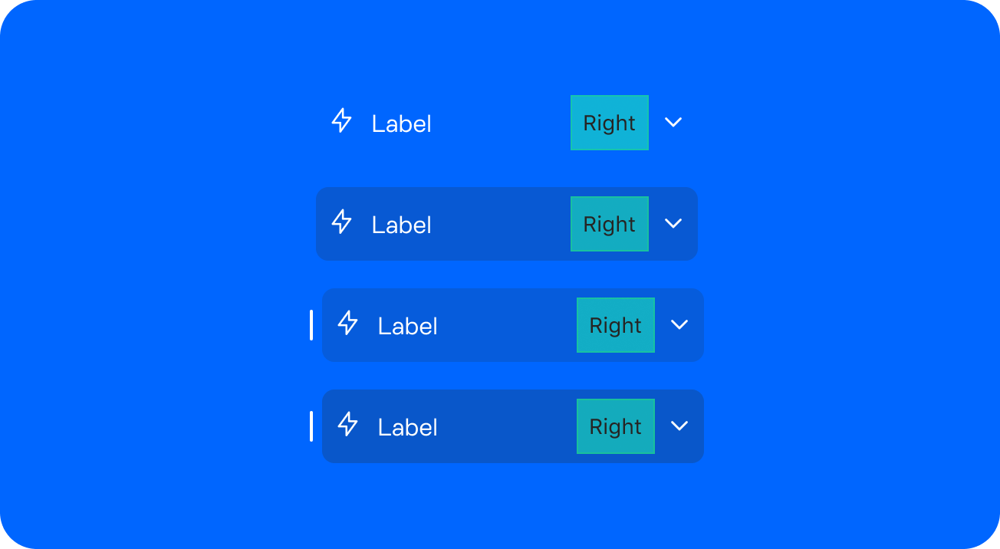

| Element                     | Token / Color                   | Font-size | Line-height | Font-weight |
| --------------------------- | ------------------------------- | --------- | ----------- | ----------- |
| Selected indicator          | controlActivatedBrand           |           |             |             |
| Asset                       | currentColor                    |           |             |             |
| Label                       | textPrimaryBrand                | text2     | text2       | text2       |
| background                  | transparent                     |           |             |             |
| background:hover            | backgroundContainerBrandHover   |           |             |             |
| background:pressed          | backgroundContainerBrandPressed |           |             |             |
| background:selected         | backgroundSelectedBrand         |           |             |             |
| background:selected:hover   | backgroundSelectedBrandHover    |           |             |             |
| background:selected:pressed | backgroundSelectedBrandPressed  |           |             |             |
| chevron                     | neutralHighBrand                |           |             |             |

#### Footer

| Element                  | Token / Color            |
| ------------------------ | ------------------------ |
| footer background        | backgroundBrandTop       |
| footer background(Boxed) | backgroundContainerBrand |
| overscroll divider       | dividerBrand             |

### Alternative

| Element                 | Token / Color                  |
| ----------------------- | ------------------------------ |
| body background         | backgroundContainerAlternative |
| body background (Boxed) | backgroundContainerAlternative |
| right divider           | divider                        |

#### Header

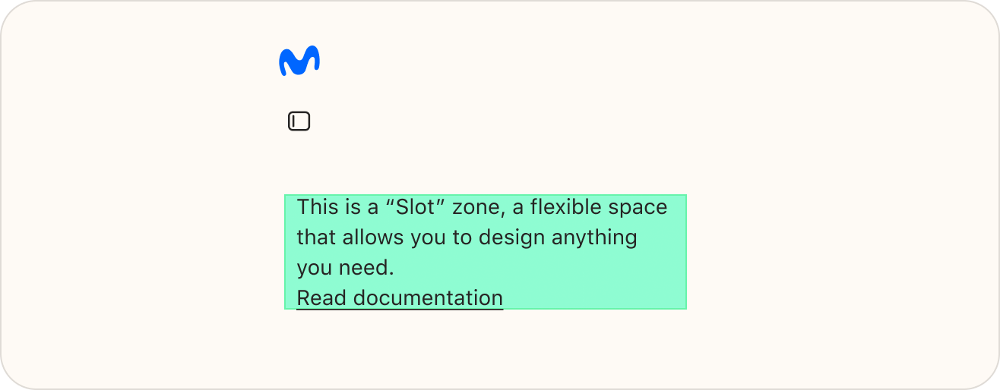

| Element                   | Token / Color                  |
| ------------------------- | ------------------------------ |
| header background         | background                     |
| header background (Boxed) | backgroundContainerAlternative |
| overscroll divider        | divider                        |

#### Section

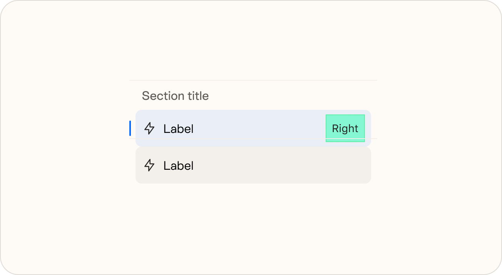

| Element       | Token / Color      | Font-size | Line-height | Font-weight |
| ------------- | ------------------ | --------- | ----------- | ----------- |
| Section title | textSecondaryBrand | text3     | text3       | text3       |
| dividers      | divider            |           |             |             |

#### Item

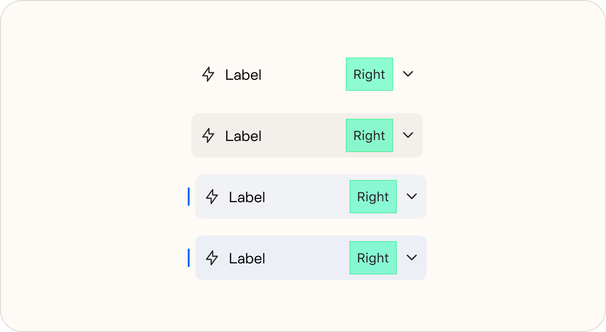

| Element                     | Token / Color              | Font-size | Line-height | Font-weight |
| --------------------------- | -------------------------- | --------- | ----------- | ----------- |
| Selected indicator          | controlActivated           |           |             |             |
| Asset                       | currentColor               |           |             |             |
| Label                       | textPrimary                | text2     | text2       | text2       |
| background                  | transparent                |           |             |             |
| background:hover            | backgroundContainerHover   |           |             |             |
| background:pressed          | backgroundContainerPressed |           |             |             |
| background:selected         | backgroundSelected         |           |             |             |
| background:selected:hover   | backgroundSelectedHover    |           |             |             |
| background:selected:pressed | backgroundSelectedPressed  |           |             |             |
| chevron                     | neutralHigh                |           |             |             |

#### Footer

| Element                   | Token / Color                  |
| ------------------------- | ------------------------------ |
| footer background         | background                     |
| footer background (Boxed) | backgroundContainerAlternative |
| overscroll divider        | divider                        |

### Negative

| Element                 | Token / Color               |
| ----------------------- | --------------------------- |
| body background         | backgroundContainerNegative |
| body background (Boxed) | backgroundContainerNegative |
| right divider           | dividerNegative             |

#### Header

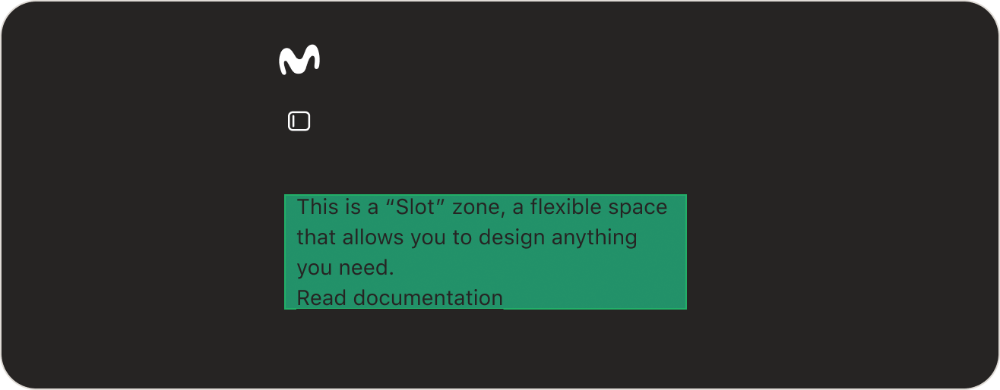

| Element                   | Token / Color               |
| ------------------------- | --------------------------- |
| header background         | backgroundNegative          |
| header background (Boxed) | backgroundContainerNegative |
| overscroll divider        | dividerNegative             |

#### Section

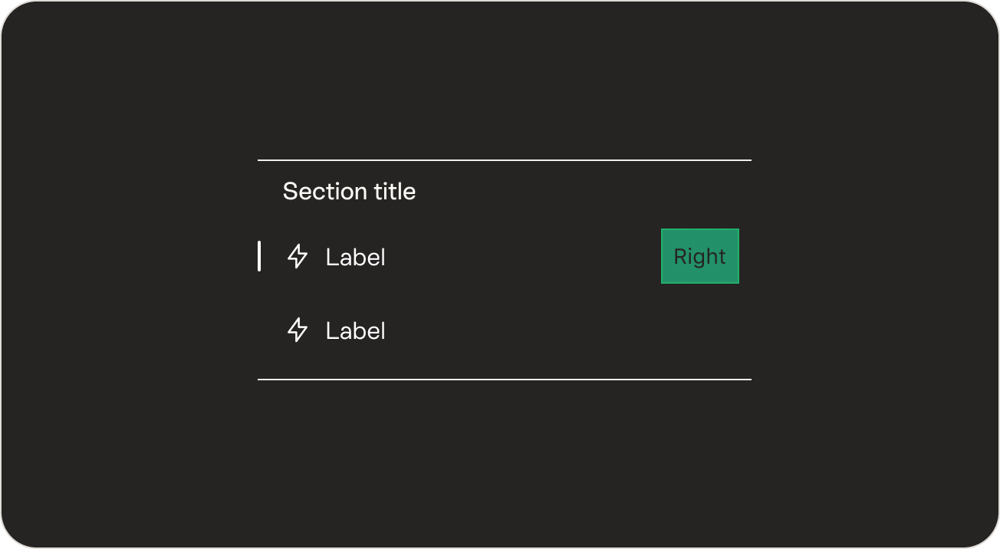

| Element       | Token / Color         | Font-size | Line-height | Font-weight |
| ------------- | --------------------- | --------- | ----------- | ----------- |
| Section title | textSecondaryNegative | text3     | text3       | text3       |
| dividers      | dividerNegative       |           |             |             |

#### Item

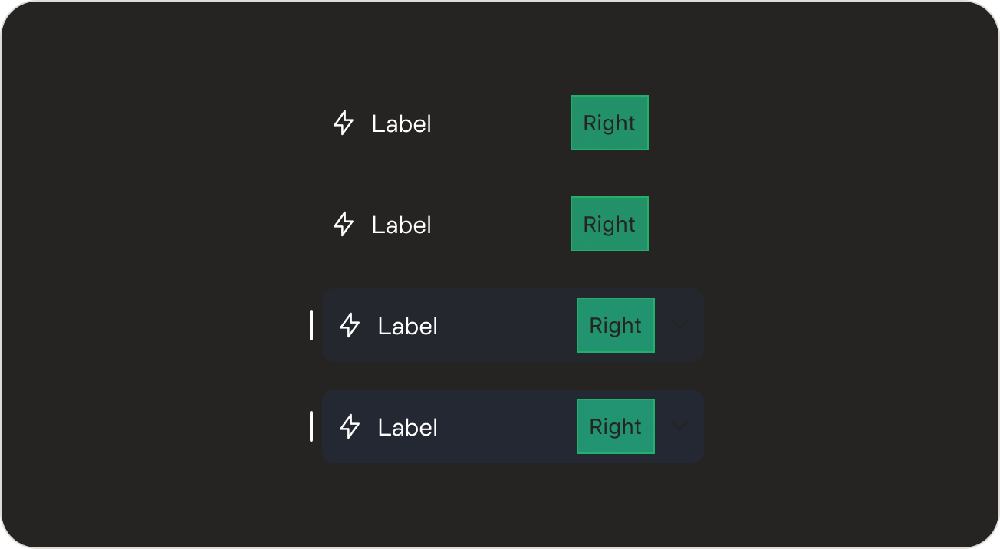

| Element                     | Token / Color                      | Font-size | Line-height | Font-weight |
| --------------------------- | ---------------------------------- | --------- | ----------- | ----------- |
| Selected indicator          | controlActivatedNegative           |           |             |             |
| Asset                       | currentColor                       |           |             |             |
| Label                       | textPrimaryNegative                | text2     | text2       | text2       |
| background                  | transparent                        |           |             |             |
| background:hover            | backgroundContainerNegativeHover   |           |             |             |
| background:pressed          | backgroundContainerNegativePressed |           |             |             |
| background:selected         | backgroundSelectedNegative         |           |             |             |
| background:selected:hover   | backgroundSelectedNegativeHover    |           |             |             |
| background:selected:pressed | backgroundSelectedNegativePressed  |           |             |             |
| chevron                     | neutralHighNegative                |           |             |             |

#### Footer

| Element                   | Token / Color               |
| ------------------------- | --------------------------- |
| footer background         | backgroundNegative          |
| footer background (Boxed) | backgroundContainerNegative |
| overscroll divider        | dividerNegative             |

### Media

| Element                 | Token / Color               |
| ----------------------- | --------------------------- |
| body background         | backgroundContainerNegative |
| body background (Boxed) | backgroundContainerNegative |
| right divider           | dividerNegative             |

#### Header

| Element                   | Token / Color               |
| ------------------------- | --------------------------- |
| header background         | backgroundNegative          |
| header background (Boxed) | backgroundContainerNegative |
| overscroll divider        | dividerNegative             |

#### Section

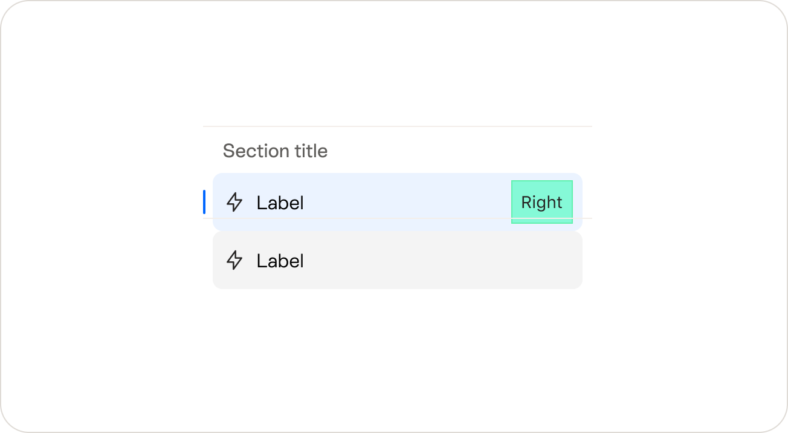

| Element       | Token / Color         | Font-size | Line-height | Font-weight |
| ------------- | --------------------- | --------- | ----------- | ----------- |
| Section title | textSecondaryNegative | text3     | text3       | text3       |
| dividers      | dividerNegative       |           |             |             |

#### Item

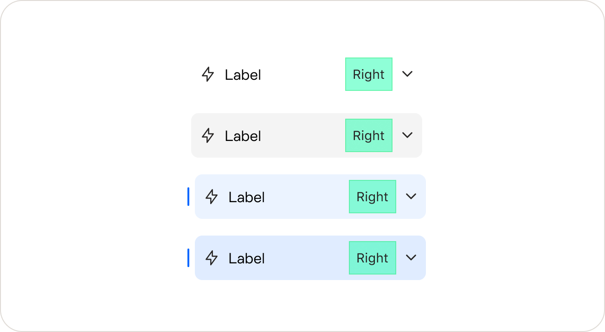

| Element                     | Token / Color                      | Font-size | Line-height | Font-weight |
| --------------------------- | ---------------------------------- | --------- | ----------- | ----------- |
| Selected indicator          | controlActivatedNegative           |           |             |             |
| Asset                       | currentColor                       |           |             |             |
| Label                       | textPrimaryNegative                | text2     | text2       | text2       |
| background                  | transparent                        |           |             |             |
| background:hover            | backgroundContainerNegativeHover   |           |             |             |
| background:pressed          | backgroundContainerNegativePressed |           |             |             |
| background:selected         | backgroundContainerSelected        |           |             |             |
| background:selected:hover   | backgroundContainerSelectedHover   |           |             |             |
| background:selected:pressed | backgroundContainerSelectedPressed |           |             |             |
| chevron                     | neutralHighNegative                |           |             |             |

#### Footer

| Element                   | Token / Color               |
| ------------------------- | --------------------------- |
| footer background         | backgroundNegative          |
| footer background (Boxed) | backgroundContainerNegative |
| overscroll divider        | dividerNegative             |

### Floating panel

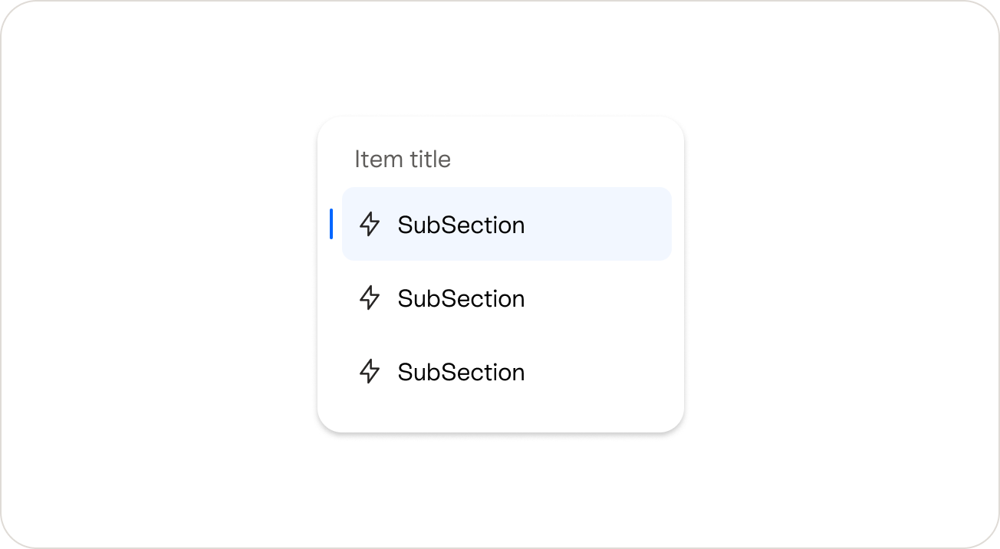

| Element              | Token / Color       | Font-size | Line-height | Font-weight |
| -------------------- | ------------------- | --------- | ----------- | ----------- |
| container background | backgroundContainer |           |             |             |
| title                | textSecondary       | text3     | text3       | text3       |

### Boxed Sidenav

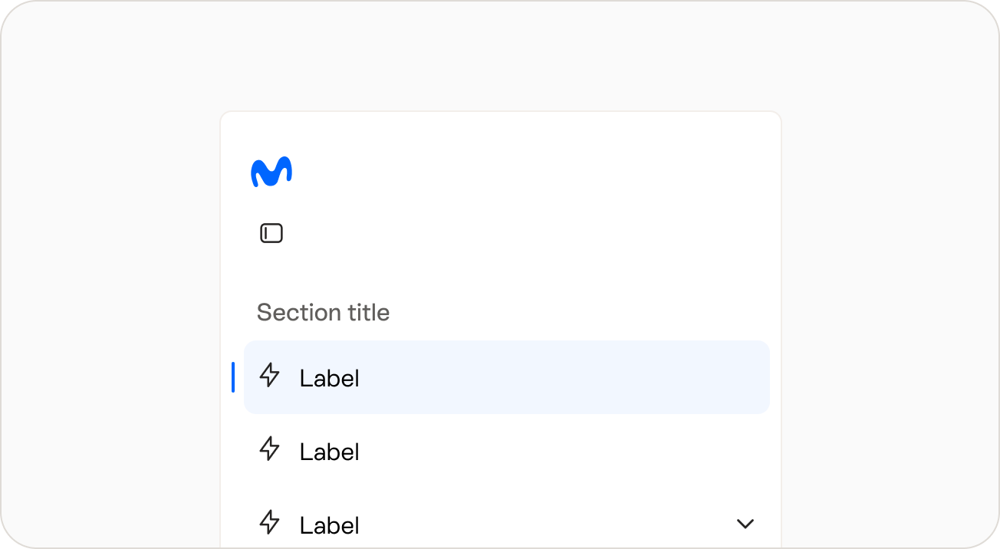

| Element | Token / Color |
| ------- | ------------- |
| border  | border        |

## Animation

## Accessibility

### General

- Navigation items should be semantically defined as a navigation
- Navigation items that have children should give the user information about their expand and collapse behaviour
- Items should allow to include an accessible name, this should be mandatory when sidenav is collapsed
- When Items that navigate and have children Two focus stop should be included in this items, one to collapse/uncollapse and another to navigate
- Dual-tier panel push, floating panel slide-in, and collapse/expand transitions must respect prefers-reduced-motion: reduce and fall back to an instant state change.

### Reading order

#### Header

1. Icon button (collapse/uncollapse)
1. Slot elements: should be announced in visual order

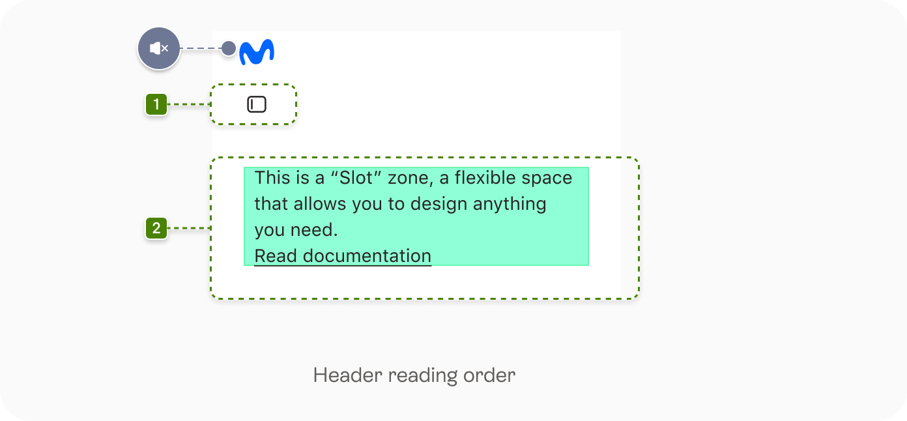

_Header reading order_

#### Item

1. Concatenate the following elements:
1. Label
1. Slot elements: should be announced in visual order
1. Icon button (Collapse/uncollapse) (if present)

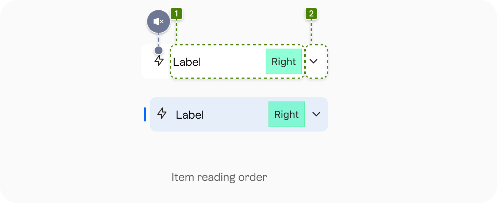

_Item reading order_

#### Double panel

Concatenate the following elements:  
 Logo (mute) 1. Collapse/uncollapse button 2. Section title 3. Item title (the item that opens the panel) Panel items 4. Item 1.1 5. Item 1.2
6.Item 1.3

Note: The panel's title is muted to avoid duplication since it matches the triggering item.

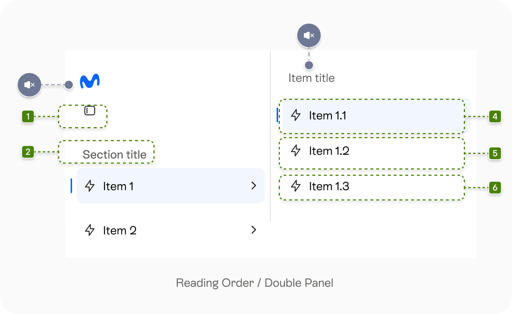

_Reading Order / Double Panel_

#### Dialog panel

Concatenate the following elements:
Logo (mute) 1. Collapse/uncollapse button2. Accessible label item 1 (collapsed)When dialog panel opens: Item title (mute - read from icon accessibility label, do not repeat)

1. Label Item 1.1
1. Label Item 1.2
1. Label Item 1.3
1. Accessible label item 2 (collapsed)
1. Accessible label item 3 (collapsed)

Note: The panel's title is muted since it's already announced via the icon's accessibility label.

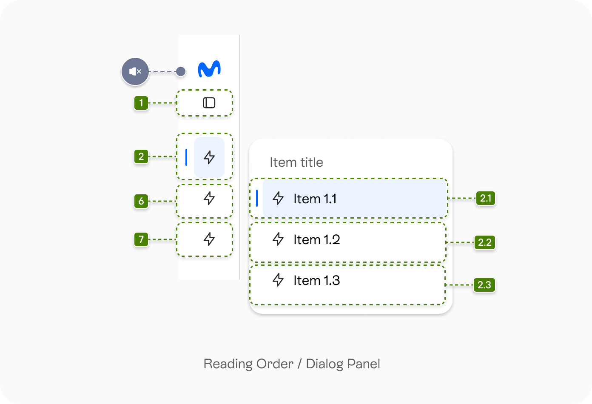

_Reading Order / Dialog Panel_

### Focus management

- When the sidenav is toggled between expanded and collapsed, focus must remain on the collapse/uncollapse button.
- Opening a floating panel does not move focus automatically; focus moves into the panel only on ArrowDown or Tab.
- Closing a floating panel returns focus to the item that triggered it.

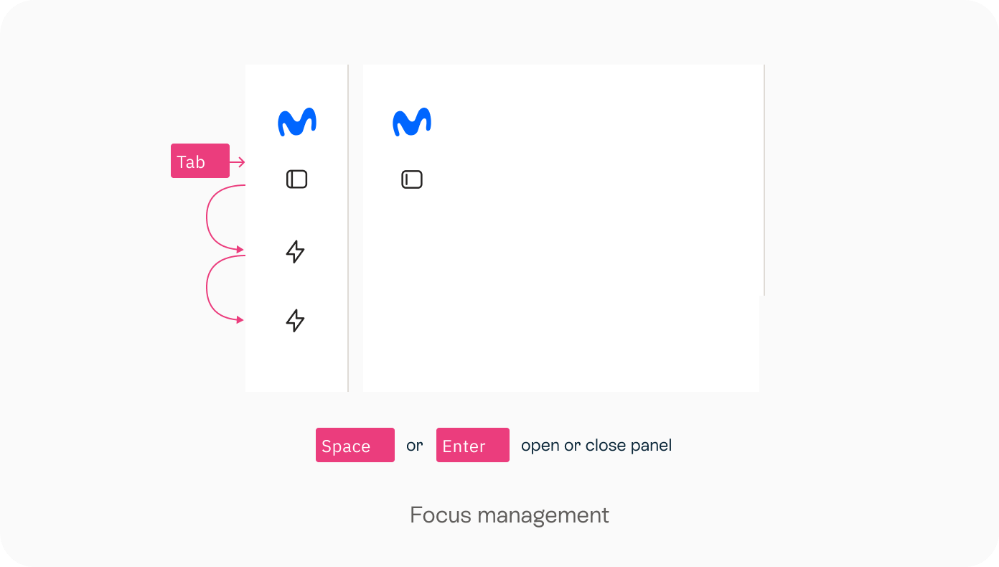

_Focus management_

### Screen reader announcements

- State changes (collapsed ↔ expanded) are conveyed by aria-expanded; no additional live region is needed.
- The selected item is announced via aria-current="page"; do not duplicate as "selected" in the label.
- When the sidenav collapses, item labels are visually hidden but must remain accessible — render them inside the button (e.g. via a visually-hidden span) so screen readers still announce them. The tooltip is supplementary, not the only label source.

### Default labels

| Element                                  | Default label              | Notes                                                                                                                             |
| ---------------------------------------- | -------------------------- | --------------------------------------------------------------------------------------------------------------------------------- |
| Sidenav landmark                         | Main navigation            | Applied as aria-label on the <nav> element                                                                                        |
| Collapse button (sidenav is expanded)    | Collapse navigation        | Announced state via aria-expanded="true"                                                                                          |
| Uncollapse button (sidenav is collapsed) | Expand navigation          | Announced state via aria-expanded="false"                                                                                         |
| Item with children — expand              | Expand {item label}        | On the chevron icon-button, not the row. Only when the item also navigates; if it only has children, the whole row is the target. |
| Item with children — collapse            | Collapse {item label}      | On the chevron icon-button                                                                                                        |
| Selected item                            | (no extra label)           | Convey via aria-current="page", not text                                                                                          |
| Floating panel (collapsed item children) | {item label} submenu       | Applied to the panel's labelling region                                                                                           |
| Section group                            | {section title} if present | When section has no title, group is unlabelled but still role="group" │                                                           |

### Keyboard interaction

| Key                 | Action                                                                                                       |
| ------------------- | ------------------------------------------------------------------------------------------------------------ |
| Tab / Shift+Tab     | Move between focus stops (each item is one stop; items with children add a second stop on the chevron)       |
| Enter / Space       | Activate the focused item or toggle the chevron                                                              |
| ArrowDown / ArrowUp | Move focus to next/previous item within the sidenav                                                          |
| ArrowRight          | On a collapsed item with children, expand it                                                                 |
| ArrowLeft           | On an expanded item with children, collapse it. On a leaf inside an expanded group, move focus to the parent |
| Home / End          | Focus first / last item in the sidenav                                                                       |
| Escape              | Close the floating panel (collapsed mode) and return focus to the triggering item                            |
