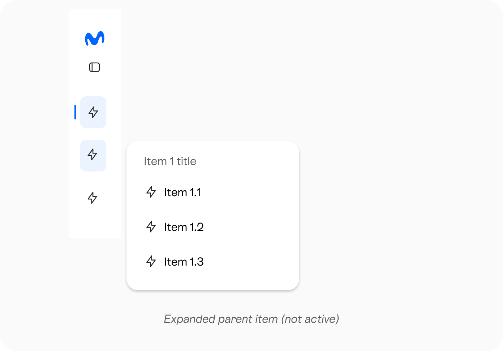
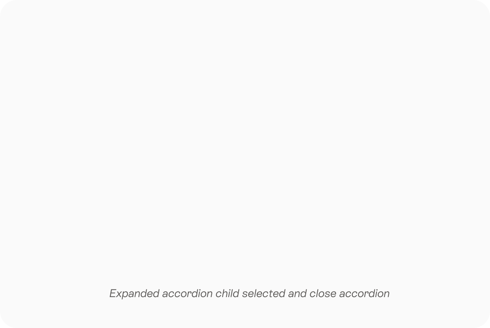
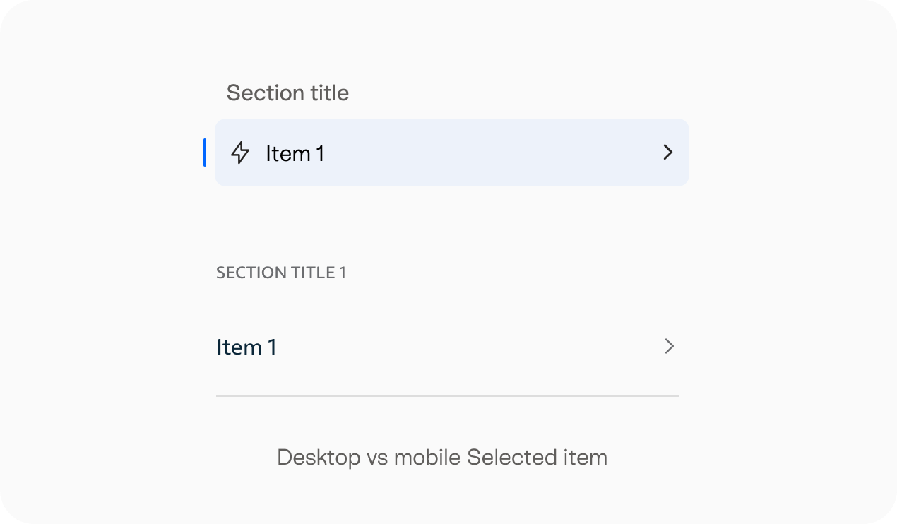
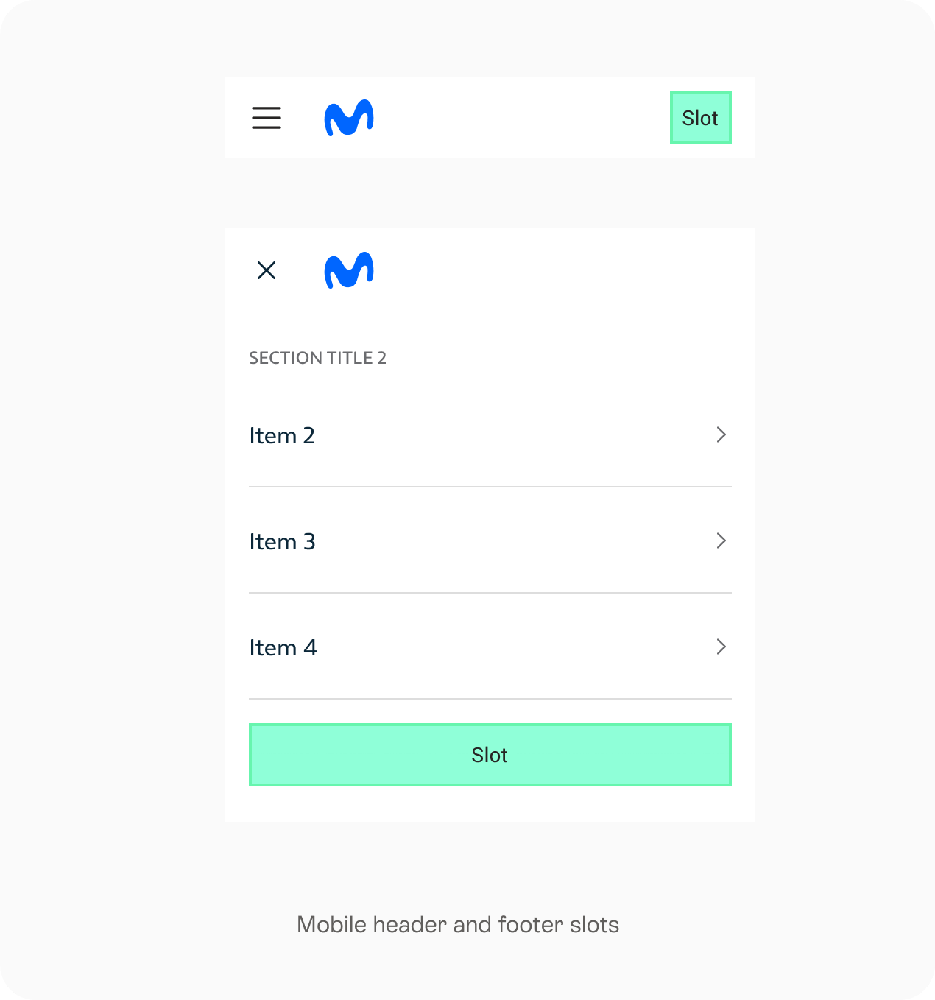
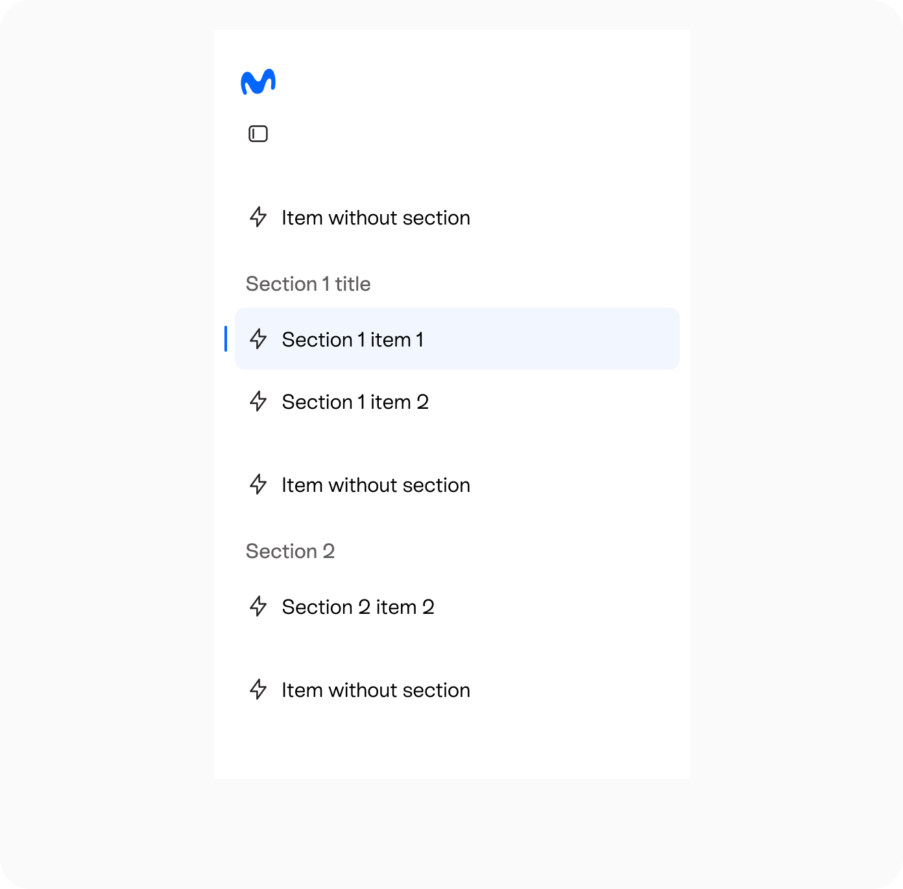

<!--
  Generated by scripts/figma-spec — do not edit by hand.
  component: sidenav
  fileKey:   4woEBHpukbLVkmk9UJTGUD
  pageId:    6510:13264
  generated: 2026-08-21T08:08:05.381Z
-->

# Sidenav

## Changelog

| Branch | Figma last modified  | Generated                |
| ------ | -------------------- | ------------------------ |
| main   | 2026-08-21T08:00:10Z | 2026-08-21T08:08:05.381Z |
| Branch | Figma last modified  | Generated                |
| main   | 2026-08-19T15:03:49Z | 2026-08-19T15:04:35.404Z |
| Branch | Figma last modified  | Generated                |
| main   | 2026-08-19T14:55:35Z | 2026-08-19T14:59:21.757Z |
| main   | 2026-08-15T09:03:29Z | 2026-08-15T09:04:08.505Z |
| main   | 2026-08-14T13:11:45Z | 2026-08-14T13:12:28.219Z |
| main   | 2026-08-12T13:48:09Z | 2026-08-12T13:48:55.378Z |
| main   | 2026-08-12T13:39:14Z | 2026-08-12T13:42:15.779Z |
| main   | 2026-08-07T18:17:35Z | 2026-08-07T18:26:50.752Z |
| main   | 2026-08-07T18:17:35Z | 2026-08-07T18:25:07.021Z |
| main   | 2026-08-07T18:17:35Z | 2026-08-07T18:18:14.317Z |
| main   | 2026-08-03T07:30:31Z | 2026-08-03T07:51:45.334Z |
| main   | 2026-07-10T12:51:51Z | 2026-07-13T06:42:10.329Z |
| main   | 2026-07-07T11:52:21Z | 2026-07-07T11:53:03.116Z |
| main   | 2026-07-07T11:47:22Z | 2026-07-07T11:47:59.902Z |
| main   | 2026-06-01T07:07:36Z | 2026-06-01T07:09:57.070Z |
| main   | 2026-05-22T08:09:25Z | 2026-05-22T08:13:17.467Z |
| main   | 2026-05-22T07:48:20Z | 2026-05-22T07:53:53.815Z |
| main   | 2026-05-22T07:46:43Z | 2026-05-22T07:47:43.211Z |
| main   | 2026-05-07T07:02:04Z | 2026-05-07T07:08:31.673Z |

## Typology

### Default

### Boxed

## Anatomy

### Container

- By default, the sidenav has a fixed width.
- Width can be overridden to any value (same as drawer).
- The right divider is vertical and spans the full height of the sidenav.
- Collapsed state can be set as the initial state.
- It is possible to use ONLY collapsed state with no expand option (prop: collapsible=false).

| Element                  | Space type | Value |
| ------------------------ | ---------- | ----- |
| Width (default)          | width      | 240   |
| Width (collapsed)        | width      | 72    |
| Right divider (optional) | height     | 100%  |

### Boxed container

- The sidenav can be displayed as a floating box (boxed). False by default.
- Incompatible with the right divider (the box already acts as separation).

| Element           | Space type | Value/token                 |
| ----------------- | ---------- | --------------------------- |
| Border radius     | radius     | popup                       |
| Inset             | margin     | 8                           |
| Height            | height     | 100% − (inset top + bottom) |
| Sidenav container | width      | 240-8px                     |
| Border (Optional) | width      | 1                           |

> See also: You can view the full elevation specs [here](https://www.figma.com/file/dvMqeg6s8tDh9Hyxu7IYDl/%F0%9F%94%B8-Subatomic-Components?node-id=6%3A220)

### Sidenav regions

- header
- body
- footer

### Header region

- Logo (Optional)
  - By default the sidenav will show the brand logo type=”isotype”
  - The logo should accept any custom element
  - The logo should allow to be changed between collapsed and exapnded states
- Collapse/uncollapse action (Included via collapse prop, can be custom rendered)
  - Action will use an IconButton component type=”neutral” background=”transparent”
- Header slot (Optional)

_Sidenav header anatomy_

| Element                       | Space type   | Value(px) |
| ----------------------------- | ------------ | --------- |
| Top/bottom padding            | padding      | 24        |
| Right padding                 | padding      | 24        |
| Left padding to logo          | padding      | 20        |
| Logo                          | width/height | 40        |
| Left padding to collapse icon | padding      | 20        |
| Gap logo to collapse icon     | gap          | 8         |
| Collapse icon                 | width/height | 32        |
| Gap collapse icon to slot     | gap          | 32        |
| Gap logo to collapse icon     | gap          | 8         |
| Gap collapse icon to slot     | gap          | 32        |

#### Section

- Section divider top (Optional)
- Section title (Optional)
- Items
- Section divider bottom (Optional)

_Section item anatomy_

| Element                        | Space type | Value(px)                             |
| ------------------------------ | ---------- | ------------------------------------- |
| Section title to items         | gap        | 8                                     |
| Section title x paddings       | padding    | 16                                    |
| Content to top/bottom dividers | gap        | 8                                     |
| Top/bottom dividers            | width      | full width (of the section container) |

#### Sidenav item

- Selected indicator: Appears only in the selected item
- Asset: Optional when expanded, but required when the sidenav is collapsed (it is the only element shown in the collapsed view).
- Item label (Optional): when collapsed appears as a tooltip on the right of the element
  - When the item has children, and the panel is open or dual panel is true and open, avoid to display a tooltip, the parent title is available on dialog or double panel
  - Other 1st level items when a dialog panel is open will not show tooltip, they only show it when collapsed or dual panel is true
- Right slot (Optional). Will be hidden when collapsed
- Chevron: appears only in items with children

The item content area appears tinted when selected and also change color when hovered or pressed

_Sidenav item anatomy (uncollapsed left, collapsed right)_

| Element                            | Space type         | Value(px)             |
| ---------------------------------- | ------------------ | --------------------- |
| Selected indicator                 | height             | 20                    |
| Selected indicator                 | width              | 2                     |
| Selected indicator to content area | gap                | 6                     |
| Content area                       | padding left/right | 8                     |
| Content area                       | height             | 44 desktop /48 mobile |
| Asset                              | width/height       | 20                    |
| Asset to label                     | gap                | 8                     |
| Label to right slot                | gap                | 8                     |
| Right slot to chevron              | gap                | 8                     |
| Chevron                            | width/height       | 16                    |

#### Item with children

An item can contain nested items.

- A 1st-level item with children only expands (it does not navigate).
- A 1st-level item without children navigates directly.
- A 2nd-level item (child) navigates and in double panel mode this also closes the panel.

Each nesting level is cumulative and indents the whole item relative to the previous level. Indentation applies to the item container, so it behaves consistently whether or not the item has an asset.

_With asset Without asset Expanded + closed Expanded + open Sidenav item anatomy (item with children)_

| Element                         | Space type   | Value(px) |
| ------------------------------- | ------------ | --------- |
| Nesting indentation (per level) | padding-left | 24        |

#### Section

- Slot (Optional)

_Sidenav footer anatomy_

| Element          | Space type | Value(px) |
| ---------------- | ---------- | --------- |
| Slot top padding | padding    | 8         |

### Dialog panel

A floating panel that is used to show the children of an item when the sidenav is collapsed, whenever is possible the panel will be anchored to the top of the trigger, matching the trigger and the first children item in the same height.

_Sidenav dialog panel anatomy_

| Element                      | Space type | Value(px) |
| ---------------------------- | ---------- | --------- |
| Section title to items       | gap        | 8         |
| Container top/bottom padding | padding    | 16        |
| Container right/left padding | padding    | 8         |
| Left gap with sidenav        | margin     | 8         |

> See also: The dialog panel follows the specifications of the Menu component. You can view full specs [here](https://www.figma.com/design/a1pgrI7Wg41iyXWU8ETqlU/%F0%9F%94%B8-Menu-Specs?node-id=1703-724&t=vwLOWfP1Om9sVVnH-4)

### Double panel

A double panel can be shown if the second level of items is defined to appear in a panel, the chevron will point to the right instead of bottom when children are in second panel. Toggling sidenav divider shouldn't change sidenav width.

_Double panel anatomy_

#### behaviour

The trigger (pressing a 1st-level item with children) opens the panel.
The panel closes if:

- A child is selected (or reselected if it already is)
- Click outside the bar (both first or second column)
- click and select a first level item with no children
- From outside a first level item with no children is selected
  Switches if:
- From outside a second level item of another parent is selected: the column moves to that parent

Keeps opened if:

- Clicked some "side nav bar" area (background for instance)
- From outside a second level level item is selected
- Click outside the bar while the open column holds the current selection

Highlight definition

- Only one first level item is highlighted: the parent of the open column
- The parent of the selected child loses the highlight while another column is open, and gets it back when that column closes
- The selected child keeps its selected indicator

| Element                      | Space type | Value(px)                              |
| ---------------------------- | ---------- | -------------------------------------- |
| Item title to items          | gap        | 16                                     |
| Container top/bottom padding | padding    | 24                                     |
| Panel right/left padding     | padding    | 8                                      |
| Width panel                  | width      | 240 (Same as sidenav panel main width) |

### Mobile

The mobile version of Sidenav is composed of a top bar and a navigation panel.

_Level 1 Level 2_

#### Top Bar

- Burger Menu → Top bar trigger
- Logo → Remains in top bar
- Header Slot → Relocates to top bar

#### Navigation Panel

- Navigation Items → Rendered inside navigation panel
- Nested Navigation Levels
- Item Slot → Rendered at right side
- Footer Slot → Rendered at the bottom of the panel content
- Divider → Not rendered

#### Compatibility note

We will aim to maintain the same API and data structure as the Navigation Bar to maximize compatibility between both components. Some differences exist, but they are explicited above.

> See also: You can view the full MainNavBar specs [here](https://www.figma.com/design/Os5UfsnhLtQ9rnzmtcX8J4/%F0%9F%94%B8-Navigation-Bar-Specs?node-id=1206-2534)

## Behaviour

### Boxed

- Sidenav container can be defined as boxed, by default will be false.
- Boxed variant cannot display right divider, since the box already works as separation.

### Collapse / Uncollapse

- Sidenav can be defined as collapsed, this definition should support:
  - user can collapse or uncollapse, by default will be uncollapsed
  - true: is collapsed and cannot be changed
  - false: is not collapsed and cannot be changed
- Collapse behavior can be triggered by any element in the UI, by default will be triggered by the provided collapse/expand icon

### Double panel

- The Double Panel is available in both boxed and default (non-boxed) variants.
- Double Panel is a global mode. When enabled, all parent items with children use the Double Panel pattern.
- The Double Panel opens when the user interacts with a parent item that contains children.
- When a child item becomes selected through an external navigation event, the Double Panel automatically opens to reveal the selected child.
- The Double Panel always displays the parent item's title as its header.
- The Double Panel pushes content when opened.
- If rightDivider is enabled, the divider is displayed within the Double Panel.
- By default, the Double Panel inherits the same width as the main Sidenav panel unless a custom width is explicitly defined.

_Double panel=”true”, uncollapsed and collapsed_

### Sections

A section can have:

- Title
- Dividers (top, bottom, or both)

Section with children:
Expanded state: the section title is shown + optional divider.
Collapsed state: the section title is hidden (reserving its space) and the divider remains visible if defined.
Divider consistency: the divider must be the same in both states (expanded/collapsed).

### Items

- An item in a collapsed sidenav view should show its label in a tooltip when hovered.
- When a child item is selected, its parent item displays its selected state.
- When the sidenav is collapsed and a child item is selected, the parent item displays its selected state but does not display the active indicator.

_Expanded parent item (not active)_

### Items / stand alone items

- An item can be sectioned or not (it may belong to a section or stand alone).

### Item dropdowns

- Inside sections, an item can have children.
- Parent items with children are used exclusively to reveal or hide their children. They do not navigate or trigger any other action when selected.
- Navigation is only available on items without children and on child items.
- When a child item becomes selected through an external navigation event, its parent item automatically displays its expanded state.
- When the sidenav is collapsed, child items can be displayed using one of the following patterns: Dialog panel: A dialog opens next to the parent item, displaying its child items. Double panel: A secondary panel appears attached to the right side of the sidenav, displaying its child items.
- Opening one parent item does not automatically collapse other parent items.
- When a child item is selected, its parent item displays its expanded state.
- The sidenav supports a single level of nesting. Child items cannot contain additional nested items.

_Double panel=”false”, uncollapsed and collapsed_

#### Accordion

- Parent items can be configured to be expanded by default. However, when the sidenav is collapsed, all parent items should appear collapsed (following the dropdown examples we have).
- Parent items retain their current expanded or collapsed state when navigation occurs elsewhere.

_Expanded accordion child selected and close accordion_

### Sections and stand alone items

### Sidenav Footer

- Appears at the bottom, uses the same definition as fixed footer when content goes underneath.
- Can be configured as fixed, by default will scroll with all sidenav content.

### Right divider

- Visible by default; configurable as true | false.
- Boxed = true cannot display the right divider, since the box already works as separation.

### Background

- The Sidenav background is customizable: it supports default variant backgrounds as well as a custom color, including transparent.
- Sidenav supports variant definition that updates the content appearance automatically.
- The body background will be defined in tokens section.
- The header and footer backgrounds cannot be transparent, since content scrolls underneath them when fixed and an opaque background is required to mask it.

### Scroll behaviour

- Sidenav will have its own scroll inside its container
- Header and footer can be defined as fixed, by default header will be fixed and footer will not
- When content goes underneath, a divider appears at the intersection to indicate that the content continues below.

_Scroll behaviour: the divider appears when the content goes underneath_

### Double panel=”false”, uncollapsed and collapsed

### Layout

- The sidenav component will provide the layout for main content to behave correctly in all breakpoints.
- Layout can vary between taking the whole viewport or centered.
- Users can either decide to use the layout provided by sidenav or to place the sidenav in a custom layout.
- Sidenav and main navigation bar are not meant to share UI, users should decide to use one or another, since responsive implications can cause collision.

#### Whole viewport

When the sidenav provides the layout for content and both take the whole viewport will follow the following:

_Whole Viewport Layout_

| Breakpoint              | Sidenav width (default) |
| ----------------------- | ----------------------- |
| Mobile & Tablet         | N/A                     |
| Desktop (1024–1919px)   | 240px                   |
| Large Desktop (≥1920px) | 296px                   |

#### Centered

When the sidenav provides the layout for content and are centered, both will be included in the responsive layout container.

_Centered layout_

| Breakpoint              | Sidenav width (default) |
| ----------------------- | ----------------------- |
| Mobile & Tablet         | N/A                     |
| Desktop (1024–1919px)   | 240px                   |
| Large Desktop (≥1920px) | 296px                   |

### Mobile

On mobile, the Sidenav follows Main Navigation Bar Mobile behaviour as closely as possible.

#### Burger Menu

- The burger menu open/close behavior emulates the Main Navigation Bar component.
- For animation details use the sames as the production Main Navigation Bar for consistency.

#### Navigation Hierarchy

The navigation is displayed as a hierarchical structure.

- Main entry point displayed in the burger menu.
- Level 1: Parent item.
- Level 2: Child item.

#### Selected items

In mobile selected items will not show any indicator they’re selected

_Desktop vs mobile Selected item_

#### Parent Items with Children

When a parent item contains children, selecting it opens the next navigation level displaying those children.

Parent items with children are not navigable and do not trigger actions. Their purpose is exclusively to reveal and organize child items.

Items without children navigate and close the panel.

Parents with selected childrens will not show any indicator that they have a selected children

#### Slot

The Header Slot is relocated to the top bar.

The Footer Slot is rendered at the bottom of the panel content and flows with the content. The fixed-bottom behaviour is not supported on mobile.

_Mobile header and footer slots_

#### custom content

Parent items can only render children navigation items. Custom content are not supported.

#### Section dividers

Section dividers are not rendered on mobile.

> See also: You can view the full MainNavBar specs [here](https://www.figma.com/design/Os5UfsnhLtQ9rnzmtcX8J4/%F0%9F%94%B8-Navigation-Bar-Specs?node-id=1206-2534)

#### Variants

The variant only affect the navigation bar, the panel is always displayed in default.

> See also: See tokens definition of main navigation bar [here](https://www.figma.com/design/Os5UfsnhLtQ9rnzmtcX8J4/%F0%9F%94%B8-Navigation-Bar-Specs?m=auto&node-id=1206-5760&t=oWllXixG7KGY1XHX-1)

## Tokens

### Default

| Element                 | Token / Color |
| ----------------------- | ------------- |
| body background         | background    |
| body background (Boxed) | background    |
| right divider           | divider       |

#### Header

| Element                   | Token / Color |
| ------------------------- | ------------- |
| header background         | background    |
| header background (Boxed) | background    |
| overscroll divider        | divider       |

#### Section

| Element       | Token / Color      | Font-size | Line-height | Font-weight |
| ------------- | ------------------ | --------- | ----------- | ----------- |
| Section title | textSecondaryBrand | text3     | text3       | text3       |
| dividers      | divider            |           |             |             |

#### Item

| Element                     | Token / Color              | Font-size | Line-height | Font-weight |
| --------------------------- | -------------------------- | --------- | ----------- | ----------- |
| Selected indicator          | controlActivated           |           |             |             |
| Asset                       | currentColor               |           |             |             |
| Label                       | textPrimary                | text2     | text2       | text2       |
| background                  | transparent                |           |             |             |
| background:hover            | backgroundContainerHover   |           |             |             |
| background:pressed          | backgroundContainerPressed |           |             |             |
| background:selected         | backgroundSelected         |           |             |             |
| background:selected:hover   | backgroundSelectedHover    |           |             |             |
| background:selected:pressed | backgroundSelectedPressed  |           |             |             |
| chevron                     | neutralHigh                |           |             |             |

#### Footer

| Element                   | Token / Color |
| ------------------------- | ------------- |
| footer background         | background    |
| footer background (Boxed) | background    |
| overscroll divider        | divider       |

### Brand

| Element                 | Token / Color           |
| ----------------------- | ----------------------- |
| body background         | navigationBarBackground |
| body background (Boxed) | navigationBarBackground |
| right divider           | dividerBrand            |

#### Header

| Element                  | Token / Color           |
| ------------------------ | ----------------------- |
| header background        | navigationBarBackground |
| header background(Boxed) | navigationBarBackground |
| overscroll divider       | dividerBrand            |

#### Section

| Element       | Token / Color      | Font-size | Line-height | Font-weight |
| ------------- | ------------------ | --------- | ----------- | ----------- |
| Section title | textSecondaryBrand | text3     | text3       | text3       |
| dividers      | divider            |           |             |             |

#### Item

| Element                     | Token / Color                   | Font-size | Line-height | Font-weight |
| --------------------------- | ------------------------------- | --------- | ----------- | ----------- |
| Selected indicator          | controlActivatedBrand           |           |             |             |
| Asset                       | currentColor                    |           |             |             |
| Label                       | textPrimaryBrand                | text2     | text2       | text2       |
| background                  | transparent                     |           |             |             |
| background:hover            | backgroundContainerBrandHover   |           |             |             |
| background:pressed          | backgroundContainerBrandPressed |           |             |             |
| background:selected         | backgroundSelectedBrand         |           |             |             |
| background:selected:hover   | backgroundSelectedBrandHover    |           |             |             |
| background:selected:pressed | backgroundSelectedBrandPressed  |           |             |             |
| chevron                     | neutralHighBrand                |           |             |             |

#### Footer

| Element                  | Token / Color           |
| ------------------------ | ----------------------- |
| footer background        | navigationBarBackground |
| footer background(Boxed) | navigationBarBackground |
| overscroll divider       | dividerBrand            |

### Alternative

| Element                 | Token / Color         |
| ----------------------- | --------------------- |
| body background         | backgroundAlternative |
| body background (Boxed) | backgroundAlternative |
| right divider           | divider               |

#### Header

| Element                   | Token / Color         |
| ------------------------- | --------------------- |
| header background         | backgroundAlternative |
| header background (Boxed) | backgroundAlternative |
| overscroll divider        | divider               |

#### Section

| Element       | Token / Color      | Font-size | Line-height | Font-weight |
| ------------- | ------------------ | --------- | ----------- | ----------- |
| Section title | textSecondaryBrand | text3     | text3       | text3       |
| dividers      | divider            |           |             |             |

#### Item

| Element                     | Token / Color              | Font-size | Line-height | Font-weight |
| --------------------------- | -------------------------- | --------- | ----------- | ----------- |
| Selected indicator          | controlActivated           |           |             |             |
| Asset                       | currentColor               |           |             |             |
| Label                       | textPrimary                | text2     | text2       | text2       |
| background                  | transparent                |           |             |             |
| background:hover            | backgroundContainerHover   |           |             |             |
| background:pressed          | backgroundContainerPressed |           |             |             |
| background:selected         | backgroundSelected         |           |             |             |
| background:selected:hover   | backgroundSelectedHover    |           |             |             |
| background:selected:pressed | backgroundSelectedPressed  |           |             |             |
| chevron                     | neutralHigh                |           |             |             |

#### Footer

| Element                   | Token / Color         |
| ------------------------- | --------------------- |
| footer background         | backgroundAlternative |
| footer background (Boxed) | backgroundAlternative |
| overscroll divider        | divider               |

### Negative

| Element                 | Token / Color      |
| ----------------------- | ------------------ |
| body background         | backgroundNegative |
| body background (Boxed) | backgroundNegative |
| right divider           | dividerNegative    |

#### Header

| Element                   | Token / Color               |
| ------------------------- | --------------------------- |
| header background         | backgroundNegative          |
| header background (Boxed) | backgroundContainerNegative |
| overscroll divider        | dividerNegative             |

#### Section

| Element       | Token / Color         | Font-size | Line-height | Font-weight |
| ------------- | --------------------- | --------- | ----------- | ----------- |
| Section title | textSecondaryNegative | text3     | text3       | text3       |
| dividers      | dividerNegative       |           |             |             |

#### Item

| Element                     | Token / Color                      | Font-size | Line-height | Font-weight |
| --------------------------- | ---------------------------------- | --------- | ----------- | ----------- |
| Selected indicator          | controlActivatedNegative           |           |             |             |
| Asset                       | currentColor                       |           |             |             |
| Label                       | textPrimaryNegative                | text2     | text2       | text2       |
| background                  | transparent                        |           |             |             |
| background:hover            | backgroundContainerNegativeHover   |           |             |             |
| background:pressed          | backgroundContainerNegativePressed |           |             |             |
| background:selected         | backgroundSelectedNegative         |           |             |             |
| background:selected:hover   | backgroundSelectedNegativeHover    |           |             |             |
| background:selected:pressed | backgroundSelectedNegativePressed  |           |             |             |
| chevron                     | neutralHighNegative                |           |             |             |

#### Footer

| Element                   | Token / Color      |
| ------------------------- | ------------------ |
| footer background         | backgroundNegative |
| footer background (Boxed) | backgroundNegative |
| overscroll divider        | dividerNegative    |

### Media

| Element                 | Token / Color      |
| ----------------------- | ------------------ |
| body background         | backgroundNegative |
| body background (Boxed) | backgroundNegative |
| right divider           | dividerNegative    |

#### Header

| Element                   | Token / Color      |
| ------------------------- | ------------------ |
| header background         | backgroundNegative |
| header background (Boxed) | backgroundNegative |
| overscroll divider        | dividerNegative    |

#### Section

| Element       | Token / Color         | Font-size | Line-height | Font-weight |
| ------------- | --------------------- | --------- | ----------- | ----------- |
| Section title | textSecondaryNegative | text3     | text3       | text3       |
| dividers      | dividerNegative       |           |             |             |

#### Item

| Element                     | Token / Color                      | Font-size | Line-height | Font-weight |
| --------------------------- | ---------------------------------- | --------- | ----------- | ----------- |
| Selected indicator          | controlActivatedNegative           |           |             |             |
| Asset                       | currentColor                       |           |             |             |
| Label                       | textPrimaryNegative                | text2     | text2       | text2       |
| background                  | transparent                        |           |             |             |
| background:hover            | backgroundContainerNegativeHover   |           |             |             |
| background:pressed          | backgroundContainerNegativePressed |           |             |             |
| background:selected         | backgroundContainerSelected        |           |             |             |
| background:selected:hover   | backgroundContainerSelectedHover   |           |             |             |
| background:selected:pressed | backgroundContainerSelectedPressed |           |             |             |
| chevron                     | neutralHighNegative                |           |             |             |

#### Footer

| Element                   | Token / Color      |
| ------------------------- | ------------------ |
| footer background         | backgroundNegative |
| footer background (Boxed) | backgroundNegative |
| overscroll divider        | dividerNegative    |

### Floating panel

| Element              | Token / Color       | Font-size | Line-height | Font-weight |
| -------------------- | ------------------- | --------- | ----------- | ----------- |
| container background | backgroundContainer |           |             |             |
| title                | textSecondary       | text3     | text3       | text3       |

### Boxed Sidenav

| Element | Token / Color |
| ------- | ------------- |
| border  | border        |

## Animation

## Accessibility

### General

- Navigation items should be semantically defined as a navigation
- Navigation items that have children should give the user information about their expand and collapse behaviour
- Items should allow to include an accessible name, this should be mandatory when sidenav is collapsed
- When Items that navigate and have children Two focus stop should be included in this items, one to collapse/uncollapse and another to navigate
- Dual-tier panel push, floating panel slide-in, and collapse/expand transitions must respect prefers-reduced-motion: reduce and fall back to an instant state change.

### Reading order

#### Header

1. Icon button (collapse/uncollapse)
1. Slot elements: should be announced in visual order

_Header reading order_

#### Item

1. Concatenate the following elements:
1. Label
1. Slot elements: should be announced in visual order
1. Icon button (Collapse/uncollapse) (if present)

_Item reading order_

#### Double panel

Concatenate the following elements:  
 Logo (mute) 1. Collapse/uncollapse button 2. Section title 3. Item title (the item that opens the panel) Panel items 4. Item 1.1 5. Item 1.2
6.Item 1.3

Note: The panel's title is muted to avoid duplication since it matches the triggering item.

_Reading Order / Double Panel_

#### Dialog panel

Concatenate the following elements:
Logo (mute) 1. Collapse/uncollapse button2. Accessible label item 1 (collapsed)When dialog panel opens: Item title (mute - read from icon accessibility label, do not repeat)

1. Label Item 1.1
1. Label Item 1.2
1. Label Item 1.3
1. Accessible label item 2 (collapsed)
1. Accessible label item 3 (collapsed)

Focus remains within the dropdown until the user presses Esc or enters/selects an item.

Note: The panel's title is muted since it's already announced via the icon's accessibility label.

_Reading Order / Dialog Panel_

### Focus management

- When the sidenav is toggled between expanded and collapsed, focus must remain on the collapse/uncollapse button.
- Opening a floating panel does not move focus automatically; focus moves into the panel only on ArrowDown or Tab.
- Closing a floating panel returns focus to the item that triggered it.

_Focus management_

### Screen reader announcements

- State changes (collapsed ↔ expanded) are conveyed by aria-expanded; no additional live region is needed.
- The selected item is announced via aria-current="page"; do not duplicate as "selected" in the label.
- When the sidenav collapses, item labels are visually hidden but must remain accessible — render them inside the button (e.g. via a visually-hidden span) so screen readers still announce them. The tooltip is supplementary, not the only label source.

### Default labels

| Element                                  | Default label              | Notes                                                                                                                             |
| ---------------------------------------- | -------------------------- | --------------------------------------------------------------------------------------------------------------------------------- |
| Sidenav landmark                         | Main navigation            | Applied as aria-label on the <nav> element                                                                                        |
| Collapse button (sidenav is expanded)    | Collapse navigation        | Announced state via aria-expanded="true"                                                                                          |
| Uncollapse button (sidenav is collapsed) | Expand navigation          | Announced state via aria-expanded="false"                                                                                         |
| Item with children — expand              | Expand {item label}        | On the chevron icon-button, not the row. Only when the item also navigates; if it only has children, the whole row is the target. |
| Item with children — collapse            | Collapse {item label}      | On the chevron icon-button                                                                                                        |
| Selected item                            | (no extra label)           | Convey via aria-current="page", not text                                                                                          |
| Floating panel (collapsed item children) | {item label} submenu       | Applied to the panel's labelling region                                                                                           |
| Section group                            | {section title} if present | When section has no title, group is unlabelled but still role="group" │                                                           |

### Keyboard interaction

| Key                 | Action                                                                                                       |
| ------------------- | ------------------------------------------------------------------------------------------------------------ |
| Tab / Shift+Tab     | Move between focus stops (each item is one stop; items with children add a second stop on the chevron)       |
| Enter / Space       | Activate the focused item or toggle the chevron                                                              |
| ArrowDown / ArrowUp | Move focus to next/previous item within the sidenav                                                          |
| ArrowRight          | On a collapsed item with children, expand it                                                                 |
| ArrowLeft           | On an expanded item with children, collapse it. On a leaf inside an expanded group, move focus to the parent |
| Home / End          | Focus first / last item in the sidenav                                                                       |
| Escape              | Close the floating panel (collapsed mode) and return focus to the triggering item                            |
